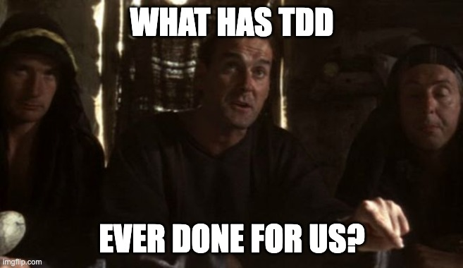

# advanced-tdd

## Introduction

Test-Driven Development (or TDD for short) is a technique that applies to all programming efforts, across all languages, for front end and back end development.

It is a key technique to _being agile_. It allows software to be written so that it:

- is easier to change
- is safe to modify later
- has fewer defects
- can be broken into small pieces
- is easier to continuously integrate

This guide will start from the basic rhythms of TDD - individual tests - before

As TDD is all about encouraging and experimenting with software design, we will be covering advanced aspects of TDD as they relate to design. These include areas such as

- Designing software components
- Dependency Inversion
- Test Doubles - simulating hard to control dependencies
- Decoupling from external systems

By the end, we should be comfortable in understanding what TDD is, how it can be applied to our work, and the benefits it can bring.

## Pre requisites

- [Go in a Day](https://github.com/bjssacademy/goinaday) for an intro to Go as a second language
- [Refactoring and Code Smells]() covering iterative re-design
- [DIP, DI and IoC]() describes the design technique supporting Test Doubles

The Go programming language is used for examples in this version. The technique applies to all languages.

An introduction to the fundamentals of programming using Go can be found [here](https://github.com/bjssacademy/fundamentals1)

This material supports the content in the BJSS Academy Intro to TDD in the Engineering Foundation Course, and also the Level 6 TDD Apprenticeship sessions.

## Start here

Right, let's crack on - what has TDD ever done for us, anyway?

[Chapter 1 >>](/chapter01/chapter01.md)
