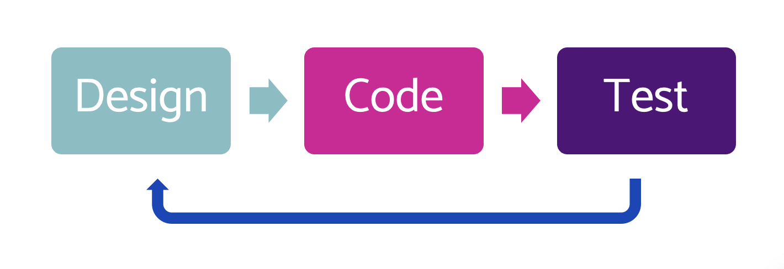

# TDD - A new, old way of being agile

Test Driven Development (or TDD for short) is often seen as a new way of developing software. It isn't, though. It was first applied in the 1960s by NASA. It is an old technique.

The real power of TDD comes from guiding us to write _specifications_ of what our code should do, and how it should be called before we think about implementation.

Ironically, TDD provides a very traditional workflow

- specify
- design
- implement
- test

## What is TDD?

A typical development workflow was to design, code and then test:

Using TDD, we invert that test step:

TDD means we _always write a **test first**_, before we write production code.

Which leads to the obvious question...

## How can we test something that doesn't exist?

**We don't**.

At least, not exactly. This is a big difference to common 'unit testing', also known as **pouting** (Plain Old Unit Testing). This practice involves writing code however we like, then attempting to retro-fit some kind of test harness around it.

> _In TDD, we **do not** fit a test to an implementation_

TDD starts with us writing an _executable specification_ for the _observable behaviour_ of a piece of code. This is a different way of thinking about the work.

TDD is old-school. We specify what our code should do before we write it. This should not be controversial. And yet, for most of our industry today, it is.

In TDD, we go one stage better than merely writing a spec as a JIRA ticket or a Word document. We write the spec in a programming language, so that we can execute that spec against the code we will write.

## TDD tests are executable specifications

The reason we write a 'test' first in TDD is that we get to specify two things about our code before we implement anything:

- What it _does_
- How we _use it_

You can see both aspects clearly in each test. The software component is being exercised in the same way as it is intended to be used.

Each test is divided into three sections, known as **Arrange, Act, Assert (AAA)**

Each section specifies a specific aspect of the behaviour of our component and its programming interface.

### Specifying behaviour

Each test will make clear:

- For a specific setup of our component (Arrange)
- When we trigger our behaviour with specific inputs (Act)
- We expect a specific outcome (Assert)

### Designing the programming interface

As part of creating the executable specification, we will call our code. We do this using the _same_ external interface that we want to be used in the rest of the codebase.

This is our chance to _design_ the programming interface we want. Rather than write some code and 'get what we get', TDD makes us intentional about our programming interfaces.

> TDD gives rapid feedback on our software design

Every test will have as compiling, running code:

- **Creating** our component
- **Configuring** our component
- **Calling** the component to trigger the behaviour
- **Inputs**, as present in a specific use case
- **Outputs** that we expect when the behaviour is met

All this will be coded, simply and clearly. We use the same programming language as the component itself for simplicity.

This provides an additional strong benefit:

> TDD provides accurate, compilable documentation

By reading a test, we see the intended usage of our code, and have captured its intended behaviour. This will not go out of step with the production code - as the _compiler_ itself will warn us of that.

### TDD tests do not specify an implementation

One thing missing from a TDD test is any constraint on _how_ we implement the code that meets the spec.

We must use the programming interface we specify in the test. We also must achieve the desired outcome.

But there will be many ways that the outcome can be implemented and satisfy the above.

> **Test behaviour, not implementation**

### The problem with implementation details in tests

Many criticisms of TDD stem from incorrectly written tests which are tightly coupled to implementation details. **Avoid this**.

Why is this a problem?

- Tests become fragile - sensitive to things that do not affect behaviour
- Refactoring becomes difficult or impossible
- Small changes inside our component ripple through the codebase (a code smell called _Shotgun Surgery_)

Our key goal in agility is to keep software easy to change. By introducing the technical problems above, we make code more expensive and more time consuming to change. The opposite of agility.

TDD actively promotes the software design technique of _strong encapsulation_. If a component hides its inner workings behind a stable programming interface, it will be easy to test and easy to use in the production code.

## Benefits of TDD

TDD actively helps us:

- Specify important outcomes
- Design a clean programming interface
- Provide accurate, compilable documentation
- Apply encapsulation and good abstractions
- Provide examples of how to use our code
- Verify the logic works as we expect
- Identify hard to use code
- Run our code before the whole application is finished
- Experiment with different implementation ideas
- Decompose our code into small, stand-alone units
- Build up a suite of regression tests and prevent future bugs

_What's not to like?_

## [Next >>](/chapter02/chapter02.md)

Let's take a look at what we mean by the vague term of 'a software component' in the next chapter. Mercifully, with a short code example.
