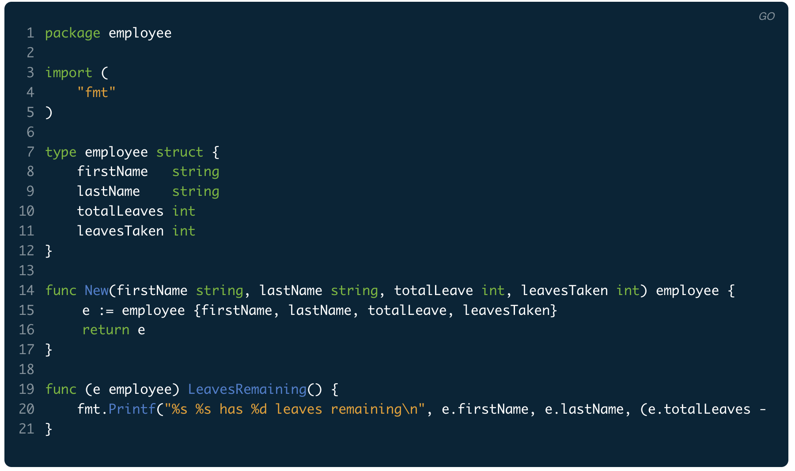
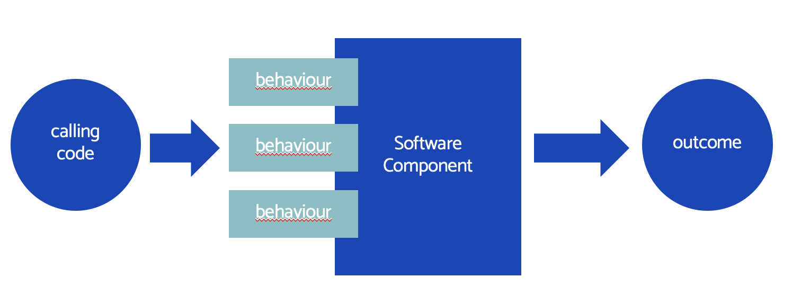

# 02: What is a software component?

We've seen that a test specifies the desired behaviour and programming interface of a 'software component'.

But what is a software component?

## Examples of software components

Before attempting a definition, let's look at some examples. As we do, consider that the _purpose_ of a component is to be a building block. Each one should help us build bigger programs out of smaller blocks. This is basic [computational thinking](https://www.bbc.co.uk/bitesize/topics/z7tp34j)

### Function

A very simple component might take two strings and join them together, connecting them with a dash:

```go
func join( first string, second string) string {
    return first + "-" + second
}
```

Notice that, while simple:

- This provides us with a higher-level behaviour than is available from the core language. We have _extended the language_
- It provides an _abstraction_. We pass in some strings and out comes our answer, without us having to deal with that logic directly.
- It _encapsulates_ the logic. The knowledge is stored in one place

### Method on an object instance

```go
type BetterString struct {
	value string
}

func (s *BetterString) join (textToJoin string) {
    s.value += "-" + textToJoin
}
```

Here, we have created a struct called `BetterString`, and added a method `join()`. It will join the second string onto the current value stored, using a dash as a connector. The same behaviour as our previous function (mostly - can you spot the difference?)

This shows an alternative _programming interface_ for our behaviour. Deciding to create a function or a method on a struct as the way we package up a behaviour is part of software design.

Software design is always a human activity. It is what we do as programmers.

### Class (or struct)

Many languages supporting Object Oriented Programming use the idea of classes. The Go language offers indirect support for classes by adding methods on structs, and having an idiomatic convention for creating object instances:



Classes allow us to group together _several related behaviours_. We can build a more powerful building block.

### Package or module

See the [Go standard library](https://pkg.go.dev/std) for an example of a number of packages offering many behaviours that can be used in an application.

Packages are also called modules in other languages. They provide a way to wrap up several sets of behaviours.

### React component

It's not just server-side code that can be componentised. Many UI frameworks support the notion of reusable components. The React framework is one example:

```jsx
class Car extends React.Component {
  render() {
    return <h2>Hi, I am a Car!</h2>;
  }
}
```

[Modern React](https://github.com/bjssacademy/react-basics/blob/main/readme.md) favours a more Functional Programming (FP) approach to producing components, rather than the Object Oriented (OO) version above. But both styles are examples of components.

Note:

- Software Components transcend programming paradigms. Procedural, scripting, object-oriented and functional paradigms can all support components

### An operator

If we write our own programming language interpreter - and this is more common than you might think - then individual _operators_ are components:

```
  result := 2 + 3
```

The + operator above is a component at a very low-level.

## Common features of software components

We notice some common features in the previous examples:

- There is code to implement some behaviour
- The component is reusable in many contexts
- There are ways to create that component and configure it
- There is a programming interface so we can use the component
- _Encapsulation_ is used. The component hides its inner working from the code which uses it

## Working definition

These features lead us to a working definition of a software component:

> A software component packages up code and data to realise a set of behaviours. This packaging allows the component to be reused in different contexts

## Outside and inside views of a component

There is an interesting and relevant point above. Software components use encapsulation. There is a difference between how we _use_ a component and how we _implement_ a component.

It is useful to think of a component as having an _outside_ and an _inside_.

The outside of the component is its public face - the programming interface that it can be used by. The inside of a component is its implementation. All the code, data and know-how are hidden inside the _black box_ (or opaque box, in more recent times).



To implement a component, we must first specify what _behaviour_ it needs to have. Second, we specify what _programming interface_ we want it to have. Ideally, we design this so that it is easy to understand and use, and difficult to use wrong. A process I term _designing-out errors_.

When we use a component, the inside view is of no consequence at all. So far as we care, the component 'just works'. It is the outside view - what does it do? How do I use it? - that is primary.

### Systems thinking

This separation of usage/implementation is absolutely fundamental to building complex systems. As a system grows to become complex, the individual components and how they work internally matter less. So long as they do their job, they will work in the wider service. The complexity arises from the _interactions_ between simple components.

Systems are fractal. A complex system is made from interacting subsystems. They themselves are made from interacting components. It's turtles all the way down until we hit cold, hard processor instructions.

## TDD and software components

TDD is a perfect pairing with software components. Components themselves are they key to computational thinking and building complex systems. Especially as complex behaviour emerges during the iterative nature of an agile project.

TDD allows us to focus on specifying the outside of a component: the desired behaviour and programming interface. It says nothing about the inside of that component. We can implement it however we like.

TDD goes that stage further than traditional written documentation by starting from _executable specifications_ of our software components.

## [Next >>](/chapter03/chapter03.md)

A brief recap, as a blatant ruse to add a cheat sheet
