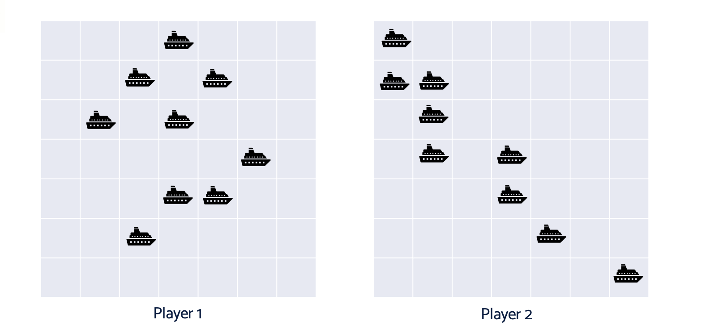
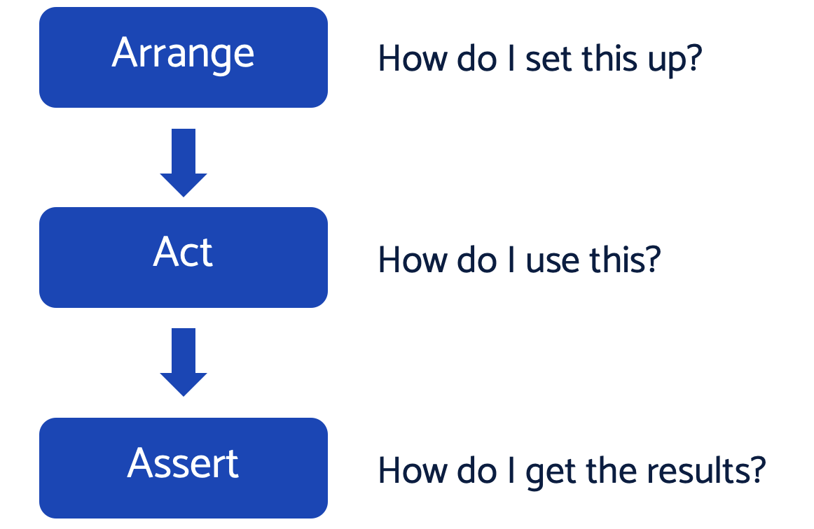
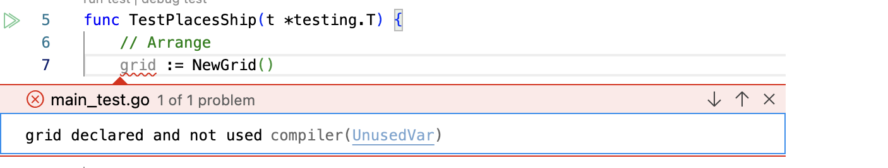

# 04: Arrange, Act, Assert

Let's write a test.

We will use Go language for our code, and we'll also need something to build. You can't test something that you don't need ;)

## Battleships - our running example

We'll build some game logic that will let us play a simplified game of battleships.



Game Description:

- Two players play the game
- Each player has a 7x7 grid
- Each player places 9 1x1 ships on their grid
- Players take turns to shoot at their opponent
- The game is won by the first player to sink all opponent's ships

## Where do we start?

This is always an issue, whether we write tests or not!

Let's choose to start with a low-level building block of the game. We will focus on the "happy path" behavious of placing a ship on the grid.

### Terminology: happy path, error path, edge case

- _Happy path_: a behaviour that correctly handles valid requests
- _Error path_: a behaviour that handles an unexpected error, such as invalid user input or system unavailability
- _Edge case_: a behaviour known to be at the boundary of a happy path and an error path. Many defects arise at edge cases!

## Placing the first ship on an empty grid

This seems like the most fundamental happy path to go for.

In TDD, we start by writing a test to form an executable specification. These tests have a standard format. They comprise three sections - Arrange, Act, Assert.



### First step: A failing test because there is no project

Just to emphasise how test-first TDD is, the first thing we will do is to fail a test because we don't even have a Go project yet.

We start by creating a a Go language empty unit test, so we can fill in the three sections:

```golang
package main

import "testing"

func TestPlacesShip(t *testing.T) {
	// Arrange

	// Act

	// Assert
}
```

we save that in our project root directory and call it `main_test.go`.

We then run all the tests with the command line

```bash
go test ./...
```

and we get the error message

```bash
go: cannot find main module
```

Which is clear and straight to the point: we can't run anything yet because we have no Go project. We fix that by running the command

```bash
go mod init battleships
```

which creates a new Go module for us, then we can re-run our tests again.

This time we get a much more friendly

```bash
ok  	battleships	0.274s	coverage: [no statements]
```

We have successfully test-driven creating a project. We have followed one cycle of 'Red, Green, Refactor', which will will discuss in detail next chapter. But for now, we've got a basic _rhythm_ of TDD down:

- Write a failing test
- Write just enough code to make the test pass

In this case, our test failure was "cannot run a test due to missing Go module" and the minimal fix was "make a Go module"

## Fleshing out our test: specifying behaviour and programming interface

So now is the time we get on our Business Analyst and Software Designer hats. We must answer the following questions, then capture our decisions in the test code:

- What should the behaviour be?
- What programming interface do we want?

Let's think about those without writing any code for a moment.

### Behaviour

In terms of the game, players need to be able to access a 7x7 grid and place up to nine ships inside it. There are some related rules:

- Each grid square can contain only one ship (or be empty)
- Each ship is 1x1 occupying only one grid location
- There are no ships occupying more than one grid location
- There's no requirement in our version to display the grid
- A player must place nine ships before the game starts
- We must consider error conditions. What if the player tries to place a ship outside the grid?

We'll revisit those in more detail. All of those are behaviours required by our game. Each one will need its own executable specification - or 'test'. There are clearly several tests/specifications that relate to placing a ship.

> How many tests do we need?
>
> Just one per thing we care about working

We can start with placing a single ship on an empty grid.

The next question is - what programming interface should we choose?

### Choosing a programming interface

By this we mean deciding how this piece of behaviour should be packaged up. How do we call it? How do we make it standalone? Our goal is to build a program out of easy to use building blocks. We want to use suitable techniques available in our language to create building blocks.

As this is the very first behavioural test, we need to pick a programming paradigm as well:

- Proedural: Good for small apps
- Object Oriented: Good at splitting up code into concepts
- Functional: Good at splitting up code along data flows

For the sake of a choice, let's choose an object oriented style. There should be a few concepts we can hang behaviours off - ships, a grid, players. It's not the only choice, nor 'the best' choice (whatever that means). But it fits the bill and is reasonable.

In Go, we can create structs with methods to give us an object oriented approach.

We need to decide how we want programmers to create an empty grid, and how we want them to place a ship. There are many possibilities - and we are in charge!

> TDD does not design your code for you - _you do_

Given a choice of OO code, we'll decide that:

- A struct will represent the Grid
- It will be called grid (although board and sea are good alternatives)
- We will have a method PlaceShip on that struct

Huzzah - we can get coding already! We have some more important decisions to make, but let's make a start

## Coding the Arrange section

One choice to make when writing a test is which of the three sections to start with.

Starting with the Assert can be very useful - working backwards from 'this is what must happen'. At other times, starting with the Act - 'this is how we how we make it happen' - is useful.

In this case, it feels like starting with Arrange - 'how do we get started' is useful.

The Arrange step is where we set up our production code under test to be ready to Act. We configure and create software components. We _wire up_ components that need to work as a group. We get ready to make the component Act - actual do the behaviour we care about.

To make our arrange for TestPlacesShip, we know that everything will start from creating an empty grid to place our ship on.

Let's do that in the IDE:


We've added line 7, which calls a free-standing function called NewGrid() that takes no parameters, and returns an instance of the grid structure we decided on earlier.

Already, TDD is driving us forward. There is a test failure - this code does not compile. The function NewGrid does not exist yet.

Let's fix that by adding a new file main.go, and writing the skelton of that function:

```golang
package main

type Grid struct {

}

func NewGrid() *Grid {
	return &Grid{}
}
```

that makes the compiler slightly less grumpy with us. `NewGrid()` has been defined, and it returns something.

We still have a failing test at this point. The compiler points out that:



But that's progress twoards our goal in a micro-iteration

> TDD is _really_ agile. It works on rapid feedback over many micro-iterations

The next step then is to briefly review what we have done so far.

Yes! That's right - review. Don't mash the keyboard just because half of one line compiles. Is it heading toward the goal still?

It seems to be going well. We don't need to pass any additional parameters into NewGrid() as that function needs no extra information to do its job. It creates an instance of the Grid struct for us and returns it.

We can move on.

## Coding the Act step

The Act step is where we get our production code to do its thing. It has been set up ready to go in the Arrange step. Now its time to go.

Again, we have some design work to do here:

- What should we call the method (or function, or what-have-you)?
- What extra information will it need from us to do its job?

It makes sense to use a method on `struct Grid` that will change the Grid to include the new ship. A sensible name is `PlaceShip` for that method.

What does `PlaceShip()` need to know from us to do its job? As a method, it already knows about what's on the Grid at present, so we don;t need to tell it that. But it must be told where to place the ship - it cannot read our minds about that!

We need to specify a location, and pass that location into the method call.

That's not as obvious as it seems, as we need another design decision here. I mean who knew that writing code needing _so many_ design decisions?

- Q: How should we represent the location of the ship?

Note that this has nothing - and I mean _nothing_ - to do with the implementation of how ships are stored. It is our choice. Dear Designer-in-Chief - what would you prefer?

Sensible options (and a few less sensible) include:

- Zero based cartesian coordinates like a graph (0,0) to (6,6)
- One based coordinates (1,1) to (7,7)
- Alphanumeric like "B2"
- _Three Little Words_ style, like "dog, banana"
- OS map grid reference (...I mean...it works for maps, right?)

The last two seem mad. But that's just me. Maybe you see utility in them. The point here is that any of these would be a valid _programming interface_ for our "place a ship on the grid" behaviour.

We decide. Not some framework. Not some implementation detail.

> Easy-to-use code starts _here_. These decisions are critical. It's why TDD makes us do them first

I decided to go basic and use that first one. A pair of integers from 0 to 6 inclusive. The first one I pass in will be the row. The second the column.

Let's capture all that information in the test:

```golang
package main

import "testing"

func TestPlacesShip(t *testing.T) {
	// Arrange
	grid := NewGrid()

	// Act
	row := 2
	column := 3

	grid.PlaceShip(row, column)

	// Assert
}
```

We've added _explaining variables_ `row` and `col` to make it totally clear which parameter is which in the test. We don't always need these - but these are a valuable tool in the toolbelt to aid readability. Get rid of them if they don't aid with that.

Remember, tests are executable specifications - and as such, live documentation. Having that skim readability is part of writing good tests.

Our compiler tells us that we have a missing method, so we can fix this in our production code:

```golang
package main

type Grid struct {

}

func NewGrid() *Grid {
	return &Grid{}
}

func (g *Grid) PlaceShip(row int, col int) {
	// Not implemented
}
```

The Mighty Compiler is assuaged from its Mighty Anger once again. Which is a good job - because we have a tricky decision to make for our final Assert section.

## Coding the Assert section

The Assert section is where we specify two things:

- What should have happened
- How we get at the results

What should have happened is obvious for our test. There should be a ship on the grid where we told it to put one!

But how we find that out is not as easy as you might think.

## Test behaviour, not implementation

The goal of TDD is to test observable behaviour - that is, what can we see 'outside the box'. What end result is our code designed to have?

Think back to executable specifications. They define what needs to happen, but place no constraints on how we do that. Our tests work best when we make them free of specification implementation details.

But this is not always easy to achieve. This fact often accounts for TDD beginners giving up in frustration: "with every code change I make, all my tests keep changing!"

Let's look at the most obvious way to write our assert, and the potential problems with it.

### Bad: asserting against the grid implementation

This test 'reaches inside' the Grid struct for its assert:

```golang
func TestPlacesShip(t *testing.T) {
	// Arrange
	grid := NewGrid()

	// Act
	row := 2
	column := 3

	grid.PlaceShip(row, column)

	// Assert
	got := grid.locations[2][3]
	want := "SHIP"

	if got != want {
		t.Error("Ship was not placed")
	}
}
```

The first thing to notice is the idiomatic way in Go to write an assert. Other languages use assertion libraries (Jest, JUnit/AssertJ, NUnit). Go does not. It uses a simple if statement. Idiomatically, there are always two local variables:

- got: the result of our Act step
- want: what we would like got to be, when everything is working

This test uses the Go idiom, but not in the best way. It locks-in too many implementation details.

Here are all the things this test locks-in:

- a private field called 'locations'
- locations is a two-dimensional array of string
- the parameters row and col given to PlaceShip index the 2D array directly
- the presence of a ship is marked by a string "SHIP"

I don't know about you, but that's a lot of highly specific detail going on there!

### Why is this bad?

The most obvious reason is that programming interface is bad. The code in our tests is the first working example of our production code being used. So, in the real game, the programmer will have to reach into the Grid, check locations[][] and look for "SHIP" - exactly as our test does.

_That is a lot to know about and a lot to do_

It is easy to make a mistake in the code that uses the result. It will lead to duplicated code. Every place that needs to know if a ship is present _must_ use this code snippet - because this _is_ now our programming interface.

The second valid reason is it will be hard to change the implementation of our Grid. This should not matter to the rest of the program. Grid should be responsible for managing ships on its own. But here, the implementation has _leaked out_. This leads to rippling changes where a small change requires a large change in the rest of the program code.

This is bad.

So what else could we do?

### "Perfect" but not good - testing the reason we need ships

A better test would involve understanding why we place ships in the first place. So our opponent can hit them and sink them.

If we think about the overall programming interface, there is no requirement suggesting we need to know where ships are. Player 1 places ships. Player 2 shoots ships. They are told if they hit or miss.

So our test could look like this:

```golang
func TestPlacesShip(t *testing.T) {
	// Arrange
	grid := NewGrid()

	// Act
	row := 2
	column := 3

	grid.PlaceShip(row, column)

	// Assert
	got := grid.ShootAt(row, column)
	want := HIT

	if got != want {
		t.Error("Ship was not placed")
	}
}
```

Here, we place a ship, then (after a bit of design) shoot at that ship. If we are told that we have a HIT, then clearly the ship must have been placed.

The Good parts of this are:

- Uses only methods that will be useful to the game
- No implementation leak so no large, rippling changes in future

Which are good things.

The bad parts:

- We are designing and writing half the game!

On balance, this 'good' test is forcing us to take too big a step forward. We want rapid feedback and small dev cycles. Sometimes, this approach is perfect - if it does not involve such a big step. A test for PUT/GET on a map might well be best tested as a pair like this.

But here, it feels like the development step is too much.

Is there are half-way house?

### Private data, public getter?

A compromise is to add a method that is useful to the test only.

That itself involves some nuance. We could, of course, keep using the 2D array, keep it private, and a a "getter". So the argument goes, this has "encapsulated" the 2D array. Nonsense and utter rubbish. No it hasn't. Not even slightly. It fully exposes the 2D array.

What happens - with numbing inevitability - is some enterprising fture programmer then uses the "test-on;y" getter to write some spaghetti code. We've lost control of our encapsulation. We've lost control of any design constraints on our programming interface.

Add ing a getter for test is not the ideal half-way house.

The compromise is a form of access with less potential for damage than exposing internals: the dipstick method.

### Using a dipstick (test-only) method

In a car engine that uses oil (remember those, Tesla fans?) it's important to keep your oil level up inside the engine. The oil is not part of the observable behaviour of the engine - which consists of foot down, speed out. But without the oil, the engine will stop working.

As such, a test-only feature is added so we can check the oil level, but not do anything else with it. We add a dipstick. Literally a stick dipped into the oil reservoir that you can read a level off. But you can't use the dipstick to go modify the design of the engine.

Here's what it looks like for our test:

```golang
func TestPlacesShip(t *testing.T) {
	// Arrange
	grid := NewGrid()

	// Act
	row := 2
	column := 3

	grid.PlaceShip(row, column)

	// Assert
	got := grid.isShipPresent(row, colum)
	want := true

	if got != want {
		t.Error("Ship was not placed")
	}
}
```

We add a method `isShipPresent(row, column)`. It will check if a ship has been placed at the row, column location. It returns `true` if so.

Our assert now has the best of both worlds - or at least a reasonable compromise:

- We're not designing more of the game than PlaceShip
- We're not exposing ay implementation details
- Future programmers are discouraged from abusing the isShipPresent() method

With the decision made to use the dipstick method, we can go on to implement our production code function PlaceShip().

But first - a philsophical detour.

### Should dipstick methods be temporary or permanent?

Given the nature of a dipstick method, should we use it to 'get us going' and then remove it later on in the development? Perhaps later, we will have TDDed a ShootAt() function - and then we could revert to our Place/Shoot test?

Maybe.

Such a wprkflow is called **scaffolding**, like on a building site. Once the building can stand unaided, the scaffolding is removed. It is part of the construction process, not part of the building.

At others times, we may find that the dipstick method becomes useful as a private helper in our production code. Then, it makes sense to leave it in permanently.

The trick is to _wait and see_. As part of a fture refactoring step, we retain the option to remove dipstick methods. But it is too early to make that decision now.

Let's move on to implementing our PlaceShip() production code.

## Implementing PlaceShip()
