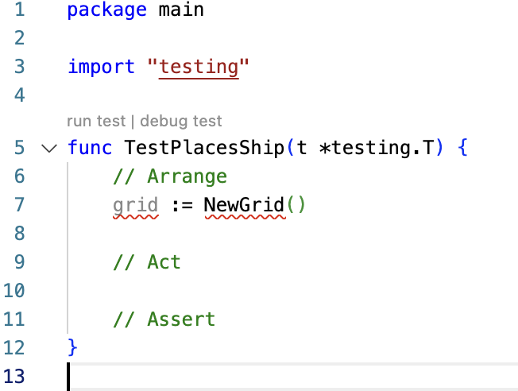

# 04: Arrange, Act, Assert

Let's write a test.

We will use Go language for our code, and we'll also need something to build. You can't test something that you don't need ;)

## Battleships - our running example

We'll build some game logic that will let us play a simplified game of battleships.


Game Description:

- Two players play the game
- Each player has a 7x7 grid
- Each player places 9 ships on their grid
- Each ship occupies only a single grid location (1x1 size)
- Players take turns to shoot at their opponent
- The game is won by the first player to sink all their opponent's ships

## Where do we start?

This is always an issue, whether we write tests or not!

Let's choose to start with a low-level building block of the game. We will focus on the "happy path" behaviour of placing a ship on the grid.

### Terminology: happy path, error path, edge case

A quick detour on some common terminology:

- **Happy path**: a behaviour that correctly handles valid requests
- **Error path**: a behaviour that handles an unexpected error, such as invalid user input or system unavailability
- **Edge case**: a behaviour known to be at the boundary of a happy path and an error path. Many defects arise at edge cases!

## Placing the first ship on an empty grid

This seems like the most fundamental happy path to go for.

In TDD, we start by writing a test to form an executable specification. These tests have a standard format. They comprise three sections - Arrange, Act, Assert.

> We must _always_ have a failing test before we write any production code
>
> Compiler errors count as failing tests


### First step: A failing test because there is no project

Just to emphasise how test-first TDD is, the first thing we will do is to fail a test because we don't even have a Go project yet.

We start by creating a a Go language empty unit test.

The first things we need to do are:

- Import the Go test library
- Write the boiler-plate function for a test (the IDE can help)
- Think of a good name for the test

### How should we name tests?

Tests are executable specifications. We want to use language that provides a summary of what this specification means. The way I think about this is "When the test passes, what will the code have achieved?"

For our first test, when the code works, it will have placed a ship on the grid.

Converting to a present tense, this becomes "Places Ship". That would be a good headline for the behaviour we are working on.

Go requires that to be a function name, so we remove spaces. The Go test framework mandates that function names of tests begin with Test.

Our final name is then `TestPlacesShip`.

This is concise, descriptive and clear.

Let's add this skeleton test function, and see if it passes or not. Test code:

```golang
package main

import "testing"

func TestPlacesShip(t *testing.T) {
	// Arrange

	// Act

	// Assert
}
```

We save that in our project root directory and call it `main_test.go`.

We then run all the tests with the command line

```bash
go test ./...
```

We see the error message

```bash
go: cannot find main module
```

Which is clear and straight to the point. We can't run anything yet because we have no Go project.

Let's fix that by running the command

```bash
go mod init battleships
```

This creates a new Go module for us.

We can re-run our tests again. This time we get a much more friendly

```bash
ok  	battleships	0.274s	coverage: [no statements]
```

We have successfully test-driven creating a project!

We have followed one cycle of 'Red, Green, Refactor', which will will discuss in detail next chapter. But for now, we've got a basic _rhythm_ of TDD down:

- Write a failing test
- Write just enough code to make the test pass

In this case, our test failure was "cannot run a test due to missing Go module" and the minimal fix was "make a Go module"

## Fleshing out our test: specifying behaviour and programming interface

So now is the time we get on our Business Analyst and Software Designer hats. We must answer the following questions, then capture our decisions in the test code:

- What should the behaviour be?
- What programming interface do we want?

Let's think about those without writing any code for a moment.

### Behaviour

In terms of the game, players need to be able to access a 7x7 grid and place up to nine ships inside it. There are some related rules:

- Each grid square can contain only one ship (or be empty)
- Each ship is 1x1 occupying only one grid location
- There are no ships occupying more than one grid location
- There's no requirement in our version to display the grid
- A player must place nine ships before the game starts
- We must consider error conditions. What if the player tries to place a ship outside the grid?

We'll revisit those in more detail. All of those are behaviours required by our game. Each one will need its own executable specification - or 'test'. There are clearly several tests/specifications that relate to placing a ship.

> How many tests do we need?
>
> Just one per thing we _care about working_

We can start with placing a single ship on an empty grid.

The next question is - what programming interface should we choose?

### Choosing a programming interface

By this we mean deciding how this piece of behaviour should be packaged up. How do we call it? How do we make it standalone? Our goal is to build a program out of easy to use building blocks. We want to use suitable techniques available in our language to create building blocks.

As this is the very first behavioural test, we need to pick a programming paradigm as well:

- Proedural: Good for small apps
- Object Oriented: Good at splitting up code into concepts
- Functional: Good at splitting up code along data flows

For the sake of a choice, let's choose an object oriented style. There should be a few concepts we can hang behaviours off - ships, a grid, players. It's not the only choice, nor 'the best' choice (whatever that means). But it fits the bill and is reasonable.

In Go, we can create structs with methods to give us an object oriented approach.

We need to decide how we want programmers to create an empty grid, and how we want them to place a ship. There are many possibilities - and we are in charge!

> TDD does not design your code for you - _you do_

Given a choice of OO code, we'll decide that:

- A struct will represent the Grid
- It will be called grid (although board and sea are good alternatives)
- We will have a method PlaceShip on that struct

Huzzah - we can get coding already! We have some more important decisions to make, but let's make a start

## What do we code first? Arrange, Act or Assert?

One choice to make when writing a test is which of the three sections to start with.

Starting with the Assert can be very useful - working backwards from 'this is what must happen'. At other times, starting with the Act - 'this is how we how we make it happen' - is useful.

In this case, it feels like starting with Arrange - 'how do we get started' is useful.

The Arrange step is where we set up our production code under test to be ready to Act. We configure and create software components. We _wire up_ components that need to work as a group. We get ready to make the component Act - actual do the behaviour we care about.

Decide on a _case by case basis_ whether you should start with arrange, act or assert.

## Coding the Arrange section

To make our arrange for TestPlacesShip, we know that everything will start from creating an empty grid to place our ship on.

Let's do that in the IDE:



We've added line 7, which calls a free-standing function called NewGrid() that takes no parameters, and returns an instance of the grid structure we decided on earlier.

Already, TDD is driving us forward. There is a test failure - this code does not compile. The function NewGrid does not exist yet.

Let's fix that by adding a new file main.go, and writing the skelton of that function:

```golang
package main

type Grid struct {

}

func NewGrid() *Grid {
	return &Grid{}
}
```

That makes the compiler slightly less grumpy with us. `NewGrid()` has been defined, and it returns something.

> Notice: we don't write the whole test/production code in one go
>
> We don't _eat the whole elephant_
>
> Iterate in micro-cycles, adding production code as we go

We still have a failing test at this point. The compiler points out that:


But that's progress toward our goal in a micro-iteration

> TDD is _really_ agile. It works on rapid feedback over many suvh micro-iterations

### Review and possibly improve our work

The next step is to briefly review what we have done so far.

Yes! That's right - review. Don't mash the keyboard just because half of one line compiles. Is it still heading toward the goal?

We don't need to pass any additional parameters into NewGrid() as that function needs no extra information to do its job. It creates an instance of the Grid struct for us and returns it.

It seems to be going well. We can move on.

## Coding the Act step

The Act step is where we get our production code to do its thing. It has been set up ready to go in the Arrange step. Now its time to make it go.

We have some design work to do here:

- What should we call the method (or function, or what-have-you)?
- What extra information will it need from us to do its job?

It makes sense to use a method on `struct Grid` that will change the Grid to include the new ship. A sensible name is `PlaceShip` for that method.

What does `PlaceShip()` need to know from us to do its job? As a method, it already knows about what's on the Grid at present, so we don;t need to tell it that. But it must be told where to place the ship - it cannot read our minds about that!

We need to specify a location, and pass that location into the method call.

That's not as obvious as it seems, as we need another design decision here.

> who knew that writing code needing _so many_ design decisions?

### Representing the location of the ship

We need to decide how to represent the location of the ship on the grid. This is a choice.

Note that this has nothing - and I mean _nothing_ - to do with the implementation of how ships are stored. It is our choice. Dear Designer-in-Chief - what would you prefer?

Sensible options (and a few less sensible) include:

- Zero based cartesian coordinates like a graph (0,0) to (6,6)
- One based coordinates (1,1) to (7,7)
- Alphanumeric like "B2"
- _Three Little Words_ style, like "dog, banana"
- OS map grid reference (...I mean...it works for maps, right?)

The last two seem mad. But that's just me. Maybe you see utility in them. Maybe a future requirement you know is coming up would make them attractive?

The point here is that _any_ of these would be a valid _programming interface_ for our "place a ship on the grid" behaviour.

We decide. Not some framework. Not some implementation detail.

> Easy-to-use code starts _here_. These decisions are critical.
> It's why TDD makes us do them first

I decided to go basic and use that first one. A pair of integers from 0 to 6 inclusive. The first one I pass in will be the row. The second the column.

Now that we have specified the programming interface, let's document that decision in the test:

```golang
package main

import "testing"

func TestPlacesShip(t *testing.T) {
	// Arrange
	grid := NewGrid()

	// Act
	row := 2
	column := 3

	grid.PlaceShip(row, column)

	// Assert
}
```

> tests are executable specifications - that makes them living documentation

We've added _explaining variables_ `row` and `column` to clarify which parameter is which in the test. If the test is clear without them, then don't use them. On balance, they add value here.

> Optimise for clarity

Our compiler tells us that we have a missing method. We can fix this in our production code:

```golang
package main

type Grid struct {

}

func NewGrid() *Grid {
	return &Grid{}
}

func (g *Grid) PlaceShip(row int, col int) {
	// Not implemented
}
```

> Again, we're not eating the whole elephant. We have added _minimal_ code to fix that compiler failure.
>
> We are working methodically, step-by-step.

The Mighty Compiler is assuaged from its Mighty Anger once again. Which is a good job - because we have a tricky decision to make for our final Assert section.

## Coding the Assert section

The Assert section is where we specify two things:

- **What** should have happened
- **How** we get at the results

What should have happened is obvious here. There should be a ship on the grid where we told it to put one!

But how we find that out is not as easy as you might think.

## Test behaviour, not implementation

The goal of TDD is to test observable behaviour - that is, what can we see 'outside the box'. What end result is our code designed to have?

Think back to executable specifications. They define _what_ needs to happen, but place no constraints on _how_ we do that. Our tests work best when we make them free of specification implementation details.

> The secret to useful TDD is specifying what, not how

But this is not always easy to achieve. This fact often accounts for TDD beginners giving up in frustration: "with every code change I make, all my tests keep changing!".

> This is _fast feedback_ from TDD warning you about your fragile design.
>
> It has nothing to do with the test.

To understand the issues, let's write our test in an obvious way, then review the potential problems with that approach.

### Bad: asserting against the grid implementation

This test 'reaches inside' the Grid struct for its assert:

```golang
func TestPlacesShip(t *testing.T) {
	// Arrange
	grid := NewGrid()

	// Act
	row := 2
	column := 3

	grid.PlaceShip(row, column)

	// Assert
	got := grid.locations[2][3]
	want := "SHIP"

	if got != want {
		t.Error("Ship was not placed")
	}
}
```

#### Assertions in Go

The first thing to notice is the idiomatic way in Go to write an assert. This is good. Other languages use assertion libraries (Jest, JUnit/AssertJ, NUnit). Go does not.

Go uses a simple if statement. Idiomatically, there are always two local variables:

- got: the result of our Act step
- want: what we would like got to be, when everything is working

#### What's the problem with this code?

The specified behaviour _locks-in_ too many implementation details.

The test means that all the following things _must_ stay true:

- a private field called 'locations'
- locations must be a two-dimensional array of string
- the parameters row and column passed to PlaceShip index the 2D array directly
- the presence of a ship must be marked by a string "SHIP"

That's a lot of highly specific detail going on there!

Do we really care about any of that?

### Why is implementation detail bad?

The point of our executable specification is to define our programming interface, and this one is bad.

The code in our tests is the first working example of our production code being used. Don;t think of this as "test code". Think of it as it really is: this is how everyone will access your component, forevermore.

> If ever there was a time for an "Are you sure?" dialog box, this would be it!

So, in the real game, the programmer will have to reach into the Grid, check `locations[row][column]` and look for `"SHIP"` - exactly as our test does.

_That is a lot to know about and a lot to do_

#### It's easy to call the code wrong

It is easy to make a mistake in the code that uses the result. It will lead to duplicated code. Every place that needs to know if a ship is present _must_ use this code snippet - because this _is_ now our programming interface.

> Prefer to _design-out_ errors, so they cannot arise

#### It's needlessly hard to change implementations in future

The second valid reason is it will be hard to change the implementation of our Grid. This should not matter to the rest of the program. Grid should be responsible for managing ships on its own. But here, the implementation has _leaked out_. This leads to rippling changes where a small change requires a large change in the rest of the program code.

This is bad.

So what else could we do?

### "Perfect" but not good - testing the reason we need ships

A better test would involve understanding why we place ships in the first place. So our opponent can hit them and sink them.

If we think about the overall programming interface, there is no requirement suggesting we need to know where ships are, outside of that component. Player 1 places ships. Player 2 shoots ships. They are told if they hit or miss.

So our test could look like this:

```golang
func TestPlacesShip(t *testing.T) {
	// Arrange
	grid := NewGrid()

	// Act
	row := 2
	column := 3

	grid.PlaceShip(row, column)

	// Assert
	got := grid.ShootAt(row, column)
	want := HIT

	if got != want {
		t.Error("Ship was not placed")
	}
}
```

Here, we place a ship, then (after a bit of design) shoot at that ship. If we are told that we have a HIT, then clearly the ship must have been placed.

The Good parts of this are:

- Uses only methods that will be useful to the game
- No implementation leak so no large, rippling changes in future

The bad parts:

- We are designing and writing half the game!

On balance, this 'good' test is forcing us to take too big a step forward. We want rapid feedback and small dev cycles. Sometimes, this approach is perfect - if it does not involve such a big step. A test for PUT/GET on a map might well be best tested as a pair like this.

But here, it feels like the development step is too much.

Is there are half-way house?

### Private data, public getter?

A useful compromise is to add a method that is useful to the test only.

That itself involves some nuance. We could, of course, keep using the 2D array, keep it private, and a a "getter". So the argument goes, this has "encapsulated" the 2D array. Nonsense and utter rubbish. No it hasn't. Not even slightly. It fully exposes the 2D array.

What happens - with numbing inevitability - is some enterprising future programmer will use the "test-only" getter to write some spaghetti code. Technically, using the code smell of [Feature Envy](https://refactoring.guru/smells/feature-envy)

At this point, we've lost control of our encapsulation. We've lost control of any design constraints on our programming interface.

Add ing a getter for test is not the ideal half-way house.

The compromise is to provide a limited form of access with less potential for damage than exposing internals: the dipstick method.

### Using a dipstick (test-only) method

In a car engine that uses oil (remember those, Tesla fans?) it's important to keep your oil level topped-up inside the engine. The oil is not part of the observable behaviour of the engine - which consists of foot down, speed out. But without the oil, the engine will stop working.

As such, a test-only feature is added so we can check the oil level, but not do anything else with it. We add a dipstick. Literally a stick dipped into the oil reservoir that you can read a level off. The design of the dipstick makes it hard to gain any real access to the engine, such that you could change how the engine worked.

Here's what a dipstick method looks like for our test:

```golang
func TestPlacesShip(t *testing.T) {
	// Arrange
	grid := NewGrid()

	// Act
	row := 2
	column := 3

	grid.PlaceShip(row, column)

	// Assert
	got := grid.isShipPresent(row, column)
	want := true

	if got != want {
		t.Error("Ship was not placed")
	}
}
```

We add a dipstick method `isShipPresent(row, column)`. It will check if a ship has been placed at the `(row, column)` location. It returns `true` if so.

Our assert now has the best of both worlds - or at least a reasonable compromise:

- We're not designing more of the game than needed for PlaceShip
- We're not exposing any implementation details
- Future programmers are discouraged from feature envy, as there is no direct access to private data

With the decision made to use the dipstick method, we can go on to implement our production code function PlaceShip().

But first - a philosophical detour. And who doesn't enjoy those every now and then?

### Should dipstick methods be temporary or permanent?

Given the nature of a dipstick method, should we use it to 'get us going' and then remove it later on in the development? Perhaps later, we will have TDDed a ShootAt() function - and then we could revert to our PlaceShip/ShootAt test?

Maybe.

Such a workflow is called **scaffolding**, like on a building site. Once the building can stand unaided, the scaffolding is removed. It is part of the construction process, not part of the building.

At others times, we may find that the dipstick method becomes useful as a private helper in our production code. Then, it makes sense to leave it in permanently.

The trick is to _wait and see_. As part of a future refactoring step, we retain the option to remove dipstick methods. But it is too early to make that decision now.

## Back to coding: We need a failing test

Now we've made our choice, let's run the test:

```bash
/Users/Alan.Mellor/academy/advanced-tdd/chapter04/code/main_test.go:16:14:
grid.isShipPresent undefined
(type Grid has no field or method isShipPresent)
FAIL battleships [build failed]
FAIL
```

Pretty self-explanatory. This clears us to add the new method on Grid:

```golang
func (g *Grid) isShipPresent(row int, col int) bool {
	return false
}
```

Everything compiles, and all three sctions of our test are complete.

To get a basic confidence that our test is looking at the right things, let's run our test as it stands now. The console tells us this:

```bash
--- FAIL: TestPlacesShip (0.00s)
    /Users/Alan.Mellor/academy/advanced-tdd/chapter04/code/main_test.go:20:
    Ship was not placed
FAIL
FAIL	battleships	0.280s
FAIL
```

Excellent! We have a failing test. We will cover why this is important in more detail in the next chapter. But for now - onwards!

Let's implement our PlaceShip() production code.

## Implementing PlaceShip()

We've arrived at an executable specification of what we want our PlaceShip() method to do, and the way we want programmers to use it. We've encapsulated the implementation details.

Now it is time to _design_ the implementation, to conform to the specification. Note: this is how things always used to be done!

> TDD is _think first, code later_

### Obviously we will use a 2D array, right?

Wrong, of course!

The beauty of TDD is it promotes the idea of _design by contract_. This has had various names over time. Bertrand Meyer coined the exact phrase when writing about his Eiffel language. But the idea dates back to at least David L. Parnas and his 1968 paper on Information Hiding.

What the rest of the code sees is our interface. That interface maintains a contract to its consumers. In our case, that contract is "you call PlaceShip(2, 3) and I will place a ship at row 2, column 3".

> A contract is a strong promise to the callers of this code

Behind this contract, we can fulfil the promise any way we like.

What are some options?

### Options to implement our data storage for ships

We can, of course, represent a Grid using the most grid-like structure available in Go. A two-dimensional array. One dimensions represents rows. the other columns. It doesn't really matter which way round they go so long as we are consistent.

This represents the play area as a fixed number of locations (array elements) which can represent our data.

For our requirements, this data needs to support two business requirements:

1. Shoot: no ship present -> player misses
2. Shoot: ship present -> player hits and ship sinks

The simplest way to do this is to use a two-value system. Each element stores one of two values to indicate presence or absence of a ship.

So we could have

- 2D Array of `string` with values `"SHIP"` and `""` (empty string)
- 2D Array of `bool` with `true` indicating presence of ship, `false` being empty
- 2D Array of named int constants - `SHIP`, `EMPTY`

But that's not the only game in town. Some other reasonable options are:

- A `uint64` treated as 64 separate bits as a bit field. 1 for ship, 0 for empty. This simplifies the game win detection by being a simple check for zero.
- A linear array of 49 elements, instead of a 2D array
- A hash map where they key is based on the location coordinates
- A slice of `type coordinates struct`. Each ship still unsunk has a coordinate pair like (2,3) placed into this slice

You can see some of these options as branches in the accompanying example code.

> **any** implementation can be chosen, because **all** fulfil the interface contract

### Exercise for the interested (or otherwise coerced) reader

- Pick an option above
- Write the code to make the test pass

As one example, here is how the 2D array using "SHIP" strings would look:

```golang
package main

const (
	ROWS = 7
	COLUMNS = 7

	SHIP = "SHIP"
)

type Grid struct {
	locations [ROWS][COLUMNS]string
}

func NewGrid() *Grid {
	return &Grid{}
}

func (g *Grid) PlaceShip(row int, col int) {
	g.locations[row][col] = SHIP
}

func (g *Grid) isShipPresent(row int, col int) bool {
	return g.locations[row][col] == SHIP
}
```

Which results in a glorious test pass:

```bash
ok  	battleships	0.190s
```

## Review

This chapter has covered

- Test behaviour, not implementation
- Arrange, Act, Assert
- No production code was written without a failing test
- Failure to compile counts as a test failure
- Micro-increments of writing the test and production code skeleton
- TDD promotes strong separation of concerns
- TDD makes us think before we code
- TDD promotes designing programming interface contracts
- Good practices if we must use test-only (dipstick) methods

## [Next >>](/chapter05/chapter05.md)

We have followed through two-thirds of one cycle of a TDD workflow. The next chapter looks at what happens next, before we move on to our next test.
