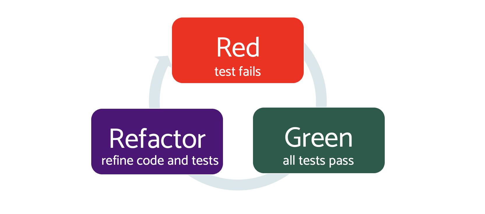
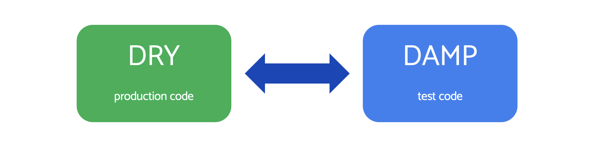

# 05: Red, Green, Refactor

In the last chapter we learned to write executable specifications, that test the desired behaviour of code. In doing that, we used one of the rhythms of TDD, the 'arrange, act, assert' structure inside the test.

Working test-first has two major rhythms like this, where we perform similar steps repeatedly.

The second major rhythm happens outside of each test. It is the flow of work that leads us from one test to the next.

In TDD, this is called Red, Green, Refactor - or RGR for short.

## Basics of RGR

These are summarised in this diagram:



A TDD cycle follows the same three steps:

- **Red**: Create a failing test (using Arrange, Act, Assert)
- **Green**: Add minimal production code to make the test pass
- **Refactor**: Improve the design of the production code - and the tests

### Red phase prerequisites - all tests pass

A TDD cycle always starts by adding a single failing test to our suite of passing tests.

We build up tests in TDD. As we add new tests, we don;t delete the old ones (normally). We allow the tests to grow into a _regression test suite_. We run these tests frequently. This provides fast feedback if a future change breaks earlier desired behaviour.

> Regression tests are part of TDD magic giving very low defect rates

Knowing at any time that the behaviour of the entire codebase _remains_ as we expect it to be powers a number of desirable things:

- Low defect rate
- Reduced mean time to repair (MTTR) for new changes
- Code known safe to integrate for Continuous Integration (CI)
- Always ready to deploy for Continuous Delivery (CD)
- Testers shift to exploratory/out-of-the-box testing

As we build up tests, we build confidence in our system.

Before we start on a Red phase proper, we ensure our code:

- passes all tests
- has a design that will support our next change

This second point means sometimes we start from the 'Refactor' step, and safely make design changes to simplify adding our new behaviour. With RGR, we are never 'stuck with' inadequate design. We have the freedom to safely change and improve, due to our regression test suite.

## Red phase

We saw the red phase in detail in the previous chapter. Working in micro-iterations, we eventually create a failing test.

It's not often that we rave about failure in software development, is it? Why do we build-in a failure phase into TDD?

The idea behind this is linked to a conondrum: if we must write a test before we write code - _who tests the test?_

Nobody tests the test. The test is written in the same way as we would write code without tests. We trust our skills to get it right.

So why is this better than just scrapping TDD and getting on with it?

The answer is twofold.

Our tests are _shorter_. They are few lines of code, giving us a better chance of visually reviewing them

Our tests are _at a higher level of abstraction_. Imagine writing a test for a complex visual processing function:

```golang
func extractNameFromImage( toExaming Image ) string {
    // ... complicated stuff goes here
}
```

The function has a simple programming interface: image in, name out. The implementaion will make us weep in all its complexity.

The test code, is equally simple. We create some image data with a name in it, call the function, check that the name comes out as a string. Done.

It is far easier to visually review the test than to visually review the image analysis code.

It is the same for all test/production code pairings.

Tests - as specifications - give us a kind of double entry bookkeeping. The test specifies what needs to happen, the code makes it happen, and the two things balance out.

This combination of simplicity plus approaching from a different angle is what creates value in TDD tests.

### Why we check the test fails

To give us some confidence in our double entry system, we want to check that the test is actually looking at the right thing.

We run a test with no real production code in place. It is clear that the behaviour of that production code _will be missing_. This is really obvious. It isn't there, so it, er, won't work.

This gives us some confidence that the test will be capable of detecting genuine code failures. It is not a guarantee. But it helps.

### What happens if the failing test passes first time?

This generally indicates that code already exists ti handle this case. Typically, after a few tests, the resulting code can be quite generalised. It will likely handle new values. This is ok.

This gives us two amber flags:

- Do we need this new test at all? Is it just duplicating another test?
- Has the test worked properly?

In the first case, if we decide the test is a duplicate with similar values, delete it. It adds negative value dragging that around.

To confirm that the test worked ok, we simply keep the expected value the same, but change the inputs to our act or arrange step. For example, suppose we wrote a new test and found it passed unexpectedly:

```golang
func TestCalculatesTotalForOneItem(t *testing.t) {
    basket := NewBasket()
    basket.addItem( "Bread", 149)

    got := basket.total()
    want := 149

    if got != want {
        t.Errorf("got %v, want %v", got, want)
    }
}
```

If this test were to pass, without us writing any production code, the first thing to do is re-run with a different value:

```golang
    basket := NewBasket()
    basket.addItem( "Bread", 999)  // <-- different value
```

If the test is working, we would expect the test to now fail, saying

```bash
  got 999, want 149
```

Whilst not complete proof that the test works, this is sufficient in practice.

## Green phase

Once we have a failing test (red) and we believe the test is correct, we can shift gears.

Green phase is where we work with the production code.

We modify the production code using three guidelines:

- Make the current test pass, do not over-generalise
- Make the minumum change possible
- Make it quick and dirty

### Don't go beyond the test

The first point is important and difficult in practice. the temptation is to go ahead of the test, and extra code to generalise. If our test shows that we can add up one number, we might try to make that pass with code that can add up two.

This is no longer _test-driven_ development at that point. It is back to POUTing again. We cannot expect the TDD benefits if we are not using it.

> TDD: No production code without a failing test

In the thought experiment above, we had one failing test. But we wrote code that would satisfy two tests at least. That's where the basic defects creep in. Off by one errors. Wrong inqualities. Wrong method called. Data overwritten. Objects left in inconsistent states.

All those can happen because we do not have any test coverage of the generalised code yet. If we get it wrong, that mistake will not be discovered at this time.

### Make minimal changes

To avoid this, we use the second guideline. Make the smallest change possible that makes that test pass - _and nothing more_. That's all there is to it. Feel free to add to your list of upcoming tests to write if you see inspiration from this step. But don't be tempted to actually code it yet.

### Quick and dirty coding is just fine - for now

Because of the RGR cycle, when in green phase, all we focus on is getting that test to pass.

We don't need to worry about naming, structure, clarity, efficiency or anything else at this point.

These things are all important, however.

They are so important that we spend an entire phase of the RGR cycle to get them right.

### Run all test before moving on

One last important point. Once the red test goes green, run the entire test suite again as a regression test.

Make sure our latest change has not broken anything.

Hidden couplings - global variables, singletons (ugh), data races - can make it so that an innocent looking change can break things in a very different section of code.

Always check using our test suite.

Once all tests are green, this actually makes a nice commit point. We could, if we wished, put this live and live with the tech debt of our quick and dirty code for a while.

Following all tests green, we move on to the final phase of RGR: Refactor.

## Refactor phase

The final phase of our RGR cycle is to refactor the code and tests.

Refactoring is defined as improving the design of our code, using a series of steps. Each step transforms the implementation of the code, but not its observable behaviour.

> Refactoring is such a good fit for TDD, isn't it?

The green phase ends once we get all tests green, including our latest one.

Following this, we have a crafty Tea, look up from squinting at the screen (Health and Safety, don't you know?) and review our work.

- Can we eliminate duplication from the code, or tests?
- Can we improve names of methods, functions, classes, structures, modules?
- Can we break up overly long code?
- Can we remove accidental complexity?
- Should we split up - or maybe combine - elements?

> Accidental complexity: using complex code where simpler code exists
>
> Essential complexity: The problem itself can be made no simpler

These are all drivers for refactoring. Under the protection of our tests, we can improve any or all of those areas in this phase.

It's important to remember that our test code needs to be treated with the same care as production code. It forms an important part of communication with future developers.

### Refactoring primer

The best resources to leran more are:

- [Refactoring Guru](https://refactoring.guru/refactoring)
- [Refactoring, Fowler](https://learning.oreilly.com/library/view/refactoring-improving-the/9780134757681/)
- [Code Smells](https://refactoring.guru/refactoring/smells)

These resources show the step-by=step nature of iteratively improving our code.

We look for a 'smell' - an inidcator that improvement may be possible. We then apply one or more refactoring recipes to change the structure of our code, without changing what it does.

When we're happy, we stop.

As a simply example, suppose we wrote quick and dirty code like this:

```golang
if jobType == "developer" && age >= 18 and mood == "mind blown" {
    buyGlue()
}
```

we could perhaps recognise that complex conditional as being the test for "unhappyAdultDeveloper", so we could extract the conditions into a function:

```golang
func isUnhappyAdultDeveloper(jobType string, age int, mood string ) bool {
    return jobType == "developer" && age >= 18 and mood == "mind blown" {
}

if ( isUnhappyAdultDeveloper(jobType, age, mood) ) {
    buyGlue()
}
```

This new code more clearly shows that the problem we are solving is that of an unhappy adult developer, a condition for which it is suggested they "buy glue". Presumably so they can relax with an arts and crafts session. Yes. That will be the reason, I expect.

In terms of code smells and refactoring for this transformation:

- Smell: complex conditional
- Refactoring: [Decompose Conditional](https://refactoring.guru/decompose-conditional)
- Benefit: self explanatory code. Easier to understand and work with

## General points on refactoring

Beyond the step by step guides in the refactoring resource, there are some general pointers as to when and how much refactoring we should do.

### DRY versus DAMP

DRY is an acronym for Don't Repeat Yourself. It is about eliminating unnecessary duplication of code. DAMP is just the English word, meaning "not quite DRY".



> Production code should be DRY
>
> Tests are better DAMP

#### Production code should be DRY

Production code should be free from duplicated (copy-pasted) code.

Why?

One of the major causes of subtle bugs starts with duplicated code. Duplication usually happens when we see a need for a block of code that looks like one we've seen elsewhere in the codebase. So we mach CTRL+C, CTRL+V and copy-paste.

That's ok at this point.

SOmetime later, the two code blocks get separated from each other so you cannot see them on screen together. A new feature - or defect report - means that the original code block needs to change.

The bug happens when we only find and change _one_ of the two duplicate blocks.

Future behaviour is riddled with subtle bugs. Sometimes the system works fine, as it executes the changed block. Other times, it seems to work in the old way - because it does. It is executing the unchanged block.

Ugh.

Pretty much all languages give us tools to avoid copy-paste code. That can be a simple as extracting a method or function containing the code block (see [Extract Method](https://refactoring.guru/extract-method) ).

##### Beware similar, yet not duplicated code

There is one important time to not DRY production code.

Two code blocks can look identical, but be part of two separate abstractions.

We might have a block of code that counts (something) and checks that exactly 9 of (something) exist. In our Battleships examples, imagine we saw two code blocks of identical code, responsible for:

- Must have 9 ships placed
- Must have paid for 9 games in advance

We can see that these two are different abstractions. They would change for different reasons. A change to payment schedule does not correlate to a change in ships in the game.

In this case, treat those identical code blocks as _intentionally separate_.

#### Test code is better DAMP

Test code should be DAMP. Duplicated code is actively encouraged in tests - to a degree.

Why?

The most important part of a test is to have a compact block of code that immediately reveals what the Arrange, Act and Assert sections do. We want the details of setup, use and expectations all in pur line of sight.

This is a balancing act. The needs of production code and tests are shaped by different drivers:

- Production code: Prefer avoiding subtle bugs caused by duplication
- Test code: Prefer immediate grasp of the test/ specification conditions

##### Taming test duplication

It can get too much, having a large amount of duplicated setup code in tests.

Two strategies are worth considering:

- Create a new test for each different 'Arrange'
- Use givenXxx() methods

For production code that is highly configurable, we force a single test to have several differing Arrange setups. It is simpler to create a separate test for each specific configuration we wish to test.

We may then also decide to use a common, extracted method to setup for that configuration.

The second option can be simpler. That is to extract the commonality in the Arrange sections into private methods in the test. Their name can start with **given** - for example, `givenNineShipsPlaced()`. This method would create a Battelships grid and place nine ships on it, in "well known" locations.

Overall, prioritise clarity of tests. Use either techniuq, or none at all, to get the best readability. Experiment with a few options, and revert if an approach does not improve matters.

### It is ok to not refactor - sometimes

A valid use of the Refactor phase is to decide that there is nothing you wish to change at this time.

- You may have already written code that meets all quality criteria
- You may decide to refactor after a couple more RGR loops
- You may intentionally defer any tech debt due to a release

You don't have to refactor in RGR.

But usually, you should. Code rots quickly. Like in an overgrown garden, the longer you leave the tidy-up, the worse the weeds spread.

### The scope of the refactor is up to you

From time to time, you will want see an poortunity to do a lrge-scale refactor of code. You might extract entire classes, replace a module or something equally large. Maybe larger.

This is actively encouraged.

The goal is to keep our code readable, testable and composable. We want to create the right abstractions in our code, so that the code tells the story of the problem it is solving/

> Emphasise what problem is being solved, not how
>
> Hide implemntation details with encapsulation and abstraction

At the end of the refactor phase, we have completed our TDD cycle. Which means we can move on to the next one. Yay! All the way until we're made redundant or die. But don't let that put you off.

Software development is fun!

## [Next >>](/chapter06/chapter06.md)

Now we've completed one full TDD RGR cycle, it's time to move on to the next cycle.

How shall we decide what to do next? That's the subject of the next chapter.
