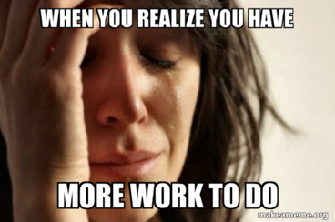

# 06: Moving to the next RGR cycle

TDD is all about forward motion, in tiny steps.

After one RGR iteration, our reward for such good work is ... more work!

The question is, of course, _what work_? What should we tackle next for our next test?



> It was ever thus

This chapter offers some useful ideas on thinking about how we drive our design forward, with intent.

## What will drive the design best?

With TDD, we use tests to drive our software design. We use the _order_ of tests we implement to control which details we add when. We are composing the overall solution from small steps, one test at a time.

The order we take these steps often leaves an imprint in our implementation. Some orders give better results than others.

### Start with a happy path

Where should we start? A simple _happy path_.

A happy path means the simplest example of the software being used successfully. Writing a test to specify this simplest case will drive out basic, useful functionality.

We can look at a shopping basket example.

We want calculate the total price of items in a shopping basket. The simplest happy path to check is that a basket with one item. The total must be the price of that item.

Our test is then:

```
TestTotalSingleItem
```

The code for that test might look like this:

```golang
func TestTotalSingleItem(t *testing.T) {

    basket := basket.New()
    basket.add( "Pizza", 495 )

    got := basket.total()

    want := 495
    if got != want {
        t.ErrorF("got %d, want %d", got, want)
    }
}
```

We check that the single item priced at 495 results in that figure as the total. We've specified that we will use an OOP approach, with a `total()` method on a basket object.

Our initial implementation can simply return the value 495 from `total()`. That gets our programming interface locked in, and our first test passing.

### Avoid weird stuff to start with

By _weird stuff_, we mean error cases, boundary conditions and any other complex rule.

All these things need developing, of course. But if we _start_ there, we tend to bend our design out of shape. The code no longer succinctly describes the expected normal behaviour. Instead, it reads out as being mainly a list of stuff that can go wrong.

Starting with the simplest happy path makes for a sane foundation. The code must draw attention to how it works when it solves the intended problem.

But after this, what next?

## Triangulation - iterating towards complete behaviour

In theory, we can write tests in any order, implement the code in any order, and clean up during the refactor steps.

In practice, adopting a structured appraoch can help us.

### Coding ZOMBIES

A useful approach is named Zombies, by James Grenning. The original article is [here](https://blog.wingman-sw.com/tdd-guided-by-zombies).


--
describe

more specific tests - more generalised code

## ZOMBIES - inspiring triangulation

notes for rest--------->
Small steps
100% legit coverage
Start happy then zombies

BIG SUB HEAD: WHEN to change or delete tests

HOW to migrate an interface step by step

Eg PlaceShip( row col ) -> PlaceShip( Location ) work through

BIG SUB HEAD LAYERED TESTS and test pyramid

- Avoiding dupe tests
- Ideally one test per behaviour
- Balance close-in to boundaries
- Talk about test layer being a fixed point
