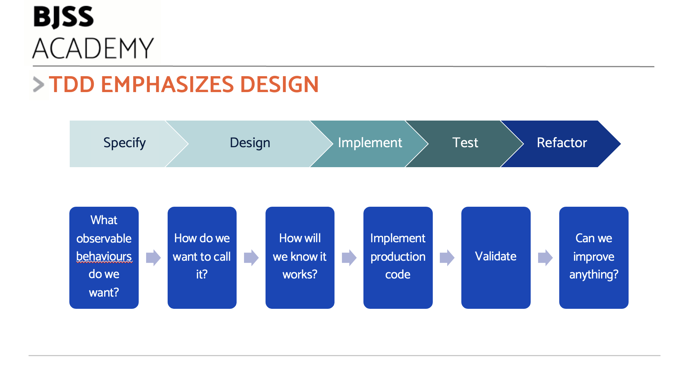
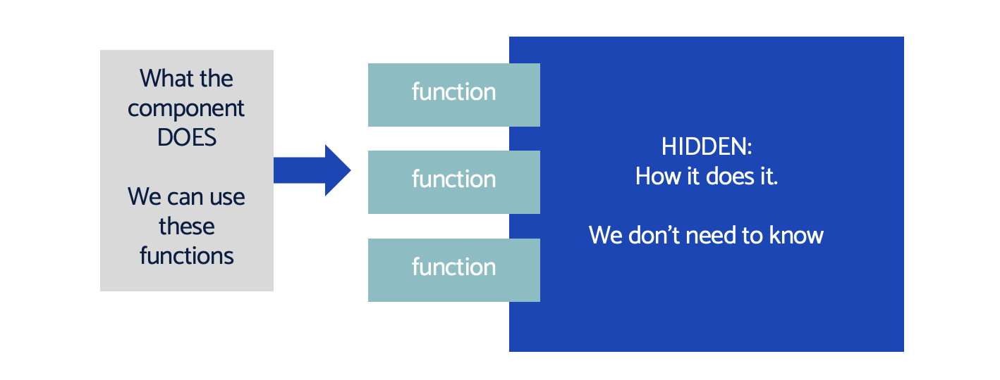
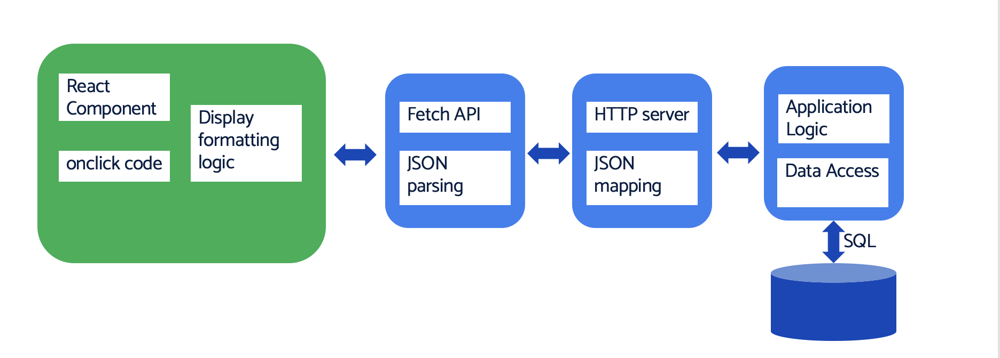
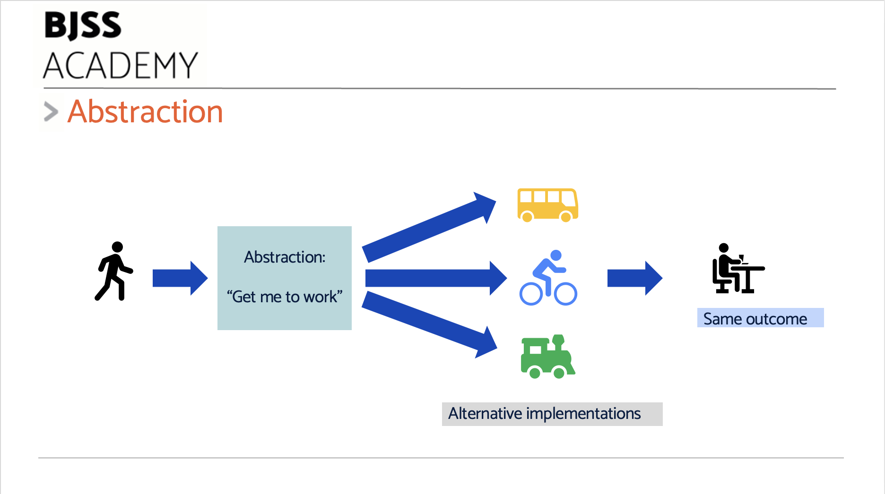

# 08: TDD and Software Design

Test-Driven Development is intimately connected with software design.

Design is the thinking behind how we structure our application. There are many designs that will make code execute the correct behaviours. But some designs are easier to work with in future than others.

This chapter provides a starting point for design thinking, along with some further resources to look into.

Let's start by describing what it is that TDD brings to the front of programming.

## What does TDD emphasise, exactly?

Tests specify the behaviour and programming interface to our code. Tests aim to exercise software components in isolation (at some granularity or other), leading to a need to make them self-contained.



This has a driving force towards three higly desirable design properties: encapsulation, low coupling and abstraction.

### Encapsulation

Encapsulation means that we understand a software component only in terms of its inputs and outputs, not by its inner workings.

It is as if the implementation of the component has been encapsulated in a thick, opaque plastic resin. We see the connections to the oustide world, but we don't know the secrets of how it works inside.



We see this in real life all the time. We know what our smart phone does; we have no need to know exactly how it works. The same with our car, out kettle and even a wall clock. We understand what they do, and how we are to use them. We don't need to know how they work inside to do that.

This gives two major benefits:

- We can **replace** them with something of equivalent functionality easily
- We have **broken down** the scope of the problem

Something with a complex inner working can have the simplest of external connections.

This simplicity of use a goal of all software design, at every granularity. It is critical to breaking down a problem. It _is_ how we break down a problem.

### Decoupling

Coupling refers to how connected something is to other system components. We prefer less coupling between components generally. If two things are coupled, then a change in one requires a change in the other. If many things are coupled, changing that software becomes next to impossible. Goodbye, agile project!



The deeper that components become intertwined, the harder it is to understand them apart. It is also harder to change one without breaking the other. Such systems are harder to test, harder to maintain and harder to replace with new tech.

The previous diagram shows a decoupled application. Take the SQL database as an example. The details of SQL are hidden from everywhere component except for the database and the data access components. Upgrading the database might need changes to the SQL. But you would not see changes in the application logic, JSON API or the React UI Components. This is an example of _abstracting the database away_ so the we can _decouple layers_.

Decoupling goes hand in hand with abstraction.

That said, you need some coupling, or else nothing could talk to anything else!

See Dave Farley's video below discussing the different kinds of coupling and how to make best use of them:

[](https://www.youtube.com/watch?v=plMttQWztRM)

### Abstraction

The goal of decoupling and encapsulation is to capture the _essence_ of a problem.

Think about the problem of getting to work:



The overall goal is to get to your desk. We can achieve that goal by taking the bus, cycling or taking the train. Well, we can unless your train is run by Northern Rail. But that aside, the exact _implementation_ of our _travel to work_ abstraction isn't as important as the fact we need to travel - somehow.

This is what abstraction is - finding the essence of a problem.

Thinking back to our battleships grid, the abstraction is a store for ships placed at locations, a way to place them, and a way to record what happens when we take a shot.

This is an abstraction of the problem. So long as we have those concepts available, we are free to implement them different ways. The implementation may change, but the abstraction will remain the same.

> Abstraction: The essence of a problem. What remains true even as we change implementation

## Design concepts are relevant to all paradigms

It's important to note that these concepts are important in every programming paradigm, every problem domain and across every language.

No matter if we are using Typescript for the UI code, using Functional Programming in Haskell, Object Oriented programming in C#, Procedural programming in C, we will want our designs to conform.

## Continuous design

A key feature of an agile/iterative project is that we cannot know the final design from the beginning. It emerges as we grow out the system.

TDD actively supports us in continuous redesign. The tests lock-in the concepts that must not change - the behaviour, and the calling interfaces - while letting us explore different wyas of achieving that. We can have confidence that our new code isn;t breaking anything we've already done.

This allows us to design in small steps, and re-design as we discover more.

## Key design techniques

Let's summarise the key technqiues for achieving those design goals.

### Encapsulation

Creating encapsulated components is all about _outside-in_ thinking. Instead of imaging how to implement the inner-workings of something, we take a step-back.

The following questions are key. Imagining ourselves as being our new software components:

- What do I need to be told that I don't already know?

This defines the inputs to our component.

When we place a battleship on the grid, that component needs to be told _where_ to place the ship. It cannot possibly know that - that's onn us! But it _does_ know where all the ships are placed already, so we don't need to tell it that. It can use this information to report back if a ship already exists at our intended location.

- What do I need to tell others?

This defines outputs and other lasting effects of our component.

Placing our battleship again, a successful placement will record that a ship has been placed at our location. We may also decide tp inform some other component - say a user interface - that a new ship has just been placed.

#### Implementation thinking

As we come to implement the component, the following questions must be answered:

- What am I allowed to remember?
- What should I know how to do myself?
- What do I need to translate?

These questions are far less important to our software design. So long as the right things get done behind our encapsulated 'wall', they are of little concern.

#### Why TDD feels backwards


This approach is why TDD feels backwards. It's natural for programmers to start thinking about how to code up some algorithm. But TDD drives us to consider how it fits in the wider picture first.

Its not TDD doing that, it is thinking in an abstract, encapsulated way.

In many ways, this should not be controversial. We are simply capturing requirements, writing a specification, designing a component and then coding it up.

### Abstraction

We can spot abstractions by playing a mind game. What would stay the same if we swap our favourtie implementation for "using a carrier pigeon"?

This might sound strange ...

Let's take our battleships placing a ship example again.

Assume we start implementation first, and we decide to use a 2D array to store ships - not an unreasonable thing to do. It follows from that that any function to place a ship could use some array indices to specify the coordinates of a ship, and that the function needs access to a 2D array.

_But what if we use a carrier pigeon instead?_

I'm glad you asked, because that weakens the position considerably. Our carrier pigeon, Percival Peckwith, isn't remotely interested in your 2D array. Percy will have to trust that the ship location is stored, but doesn't care how. Nor does Percy care about zero-based array indices to specify a location. He will just take the location, and pass the request on.

To find our abstraction, we:

- Assume storage is taken care of
- Need to communicate a request to store a ship at a location
- Decide on a coordinate system for that location

So we might decide on an abstraction like this:

```golang
type OneBasedInt int

type Location struct {
	Row    string
	Column OneBasedInt
}

type Ships interface {
	PlaceShip(loc Location) error
}
```

This represents our abstract design. Something to store ships, but we don't care how, exactly. A way of specifying a location - in a human readable way.

When we come to implement this, we conform to our abstraction, and make some detailed choices:

```golang
type ShipStore struct {
	ships [7][7]string // decision to use 2D array
}

func (s *ShipStore) PlaceShip(l Location) error {
	// Not Implemented
	return nil
}

func main() {
	var allShips Ships
  allShips = &ShipStore{}

	where := Location{Row: "C", Column: 1}
	allShips.PlaceShip(where)
}
```

The choice here to go with the 2D array to store ships is relatively unimportant. The `PlaceShip` code will have to translate between the "A1" style location we chose to the array-friendly `[0][0]` subscripts.

> Key TDD Point: We do not have to 'ripple out' implementation details through our interface.
> We _choose_ to separate interface from implementation as designers.
> We can translate in the implementation.

### Decoupling

Two things A and B are coupled together when a change in A requires a matching change in B, otherwise B will stop working.

Sometimes, these couplings are obvious and the code explicitly states what they are. Othertimes, they are implicit - sneaky little things that must change together, despite that not being obvious.

We need coupling. Whenever we call a function, the code doing the calling is coupled strongly to the called function. We need to _control_ coupling. We need to make sure that we only couple things together that should be coupled together.

Examples of coupling:

- Repeated magic numbers in code, eg "99" meaning maximum 99 items
- SQL database query strings in the application; couple to a specific database
- API parameters in a web service

We can weaken the coupling above. We can replace the repeated numbers with a well-named constant. We can wrap our database SQL queries behind a technology-free function or inside an object. We can wrap our API calls behind an Adapter object. Doing these things limits the amount of change we need to make if one side or other of that coupling must change.

We can completely decouple two things using the Dependency Inversion Principle. We'll return to that later, when we discuss Test Doubles.

> -How many more examples of coupling can you think of from your past work?
> -How could you weaken it?

### Accidental v essential complexity

The biggest killer of code we see is accidental complexity.

There are two kinds of complexity in software:

- Essential complexity, because a problem is hard
- Accidental complexity, when we make a simple problem needlessly hard

As we learn new languages, patterns and technologies, we are prone to adding accidental complexity. We do things in a conviluted way, perhaps incorrectly applying a pattern from elsewhere.

We need to fight accidental complexity. The KISS mnemonic is a reminder to do that.

> KISS - Keep it simple!

A lot of the time, this is done by using the simplest syntax, with the simplest algorithm and the clearest data structure. It is usually better to split complex statements and functions up into smaller blocks.

### Beck's Four Rules of Simple Design

Take a look at these four principles:

https://martinfowler.com/bliki/BeckDesignRules.html

Ths advice says well-designed code has four properties:

- Passes the tests
- Reveals intention
- No duplication
- Fewest elements

## How TDD helps reveal design flaws

TDD provides fast feedback on our design choices.

Every test has three sections, Arrange, Act and Assert. These are specifications for three things:

- Arrange: How easy is the code to setup, connect and configure?
- Act: How easy is the code to use, to do its main purpose?
- Assert: How easy is it to get at the results?

If you critically review each test section, you will see where improvements can be made. For instance, if the Arrange section is full of configuration, we could add useful defaults. If it needs to wire together many different components, we could consider a helper to simplify. We could consider using a [factory method](https://refactoring.guru/design-patterns/factory-method), [Builder](https://refactoring.guru/design-patterns/builder), or [extract an object](https://refactoring.com/catalog/introduceParameterObject.html) from the parameter list) to help.

The same goes for the Act and Assert sections. Each one accurately reflects what this component is like to use, for real. If any section looks difficult to understand, or has any kind of gotchas, it is time to simplify.

Note that we can do this _before_ we write any production code. One benefit of writing the test first is we get to see the design as we intend it, before we implement.

## Three general principles

These old ideas are evergeen: keep things simple, avoid duplication and defer decisions until a need becomes apparent.

### KISS - Keep it Simple

Originally termed -Keep it Simple, Stupid- the KISS idea should be self-explanatory. Prefer simple solutions!

Because of human ego, it isn't quite as obvious as it should be, so we'll spell it out!

> Make things as simple as possible

Generally, we can build things in multiple ways. Some of those ways will be more difficult to understand. Some ways will be easier to understand. But all approaches are interchangeable, as they all do the exact same thing.

Choose the one that is simplest to understand.

### DRY - Don't Repeat Yourself

It's very difficult to safely change code when multiple copies of one piece of information exist.

We've all seen this:

- Code blocks copy-pasted everywhere
- Magic numbers throughout the code
- Multiple different functions, all doing the same thing
- Multiple sources of data (ugh, that one is the nastiest of all)

The solution is to have a single source of truth for everything. One constant. One function. One library. One data source.

This is given the name -Don't Repeat Yourself- and means just that. For each piece of truth, define it once and refer to it throughout the code.

This is also a key to finding abstractions: discovering where some fact or logic keeps turning up. Why? What about the problem makes it do that?

### YAGNI - You ain't gonna need it

This is a way of thinking central to working in short iterations.

It's tempting to plan ahead, looking far into the future, and guessing possible future requirements and possible future changes. For an engineer, it is then tempting to design flexibility into the code to handle these guesses.

DO NOT DO THIS!

The guesses will be wrong, generally. You then are stuck with bloated code that has some unpleasant properties:

- The code is way more complex than it ever needed to be
- The design fails to support the actual change
- The design you added actively gets in the way of the change!
- Future maintainers cannot tell that this over-design serves no purpose. It looks like real code to them.

The best plan is to restrict future planning. Accommodate short-term known growth, yes. But resist long term "flexible, configurable" rabbit holes.

## Generalising code

When doing TDD and using triangulation, we start with very specific implementations. As we add more specific tests, the implementation gets more general.

> Tests get more specific - implementation gets more general

There are several techniques that allow us to generalise code, in steps.

Once the variations are known, you can revise the concrete code to be more flexible, summarised next.

### Add variables

Replaced a fixed constant with a calculated variable:

```golang
func (b Basket) totalPrice() int {
  return 100 // get the first test to pass
}
```

Generalise this by adding the real calculation in a variable:

```golang
func (b Basket) calculateTotalPrice() int {
  total := 0

  for _, item := range b.items {
    total += item.Price
  }

  return total
}
```

Variables, and code to compute them, seem an almost trivial example.

### Add configuration

Replace hard coded constants and limits with data pulled from a configuration source:

```golang
func connect() {
  connection := connectTo( "https://somewhere.com/server")
}
```

hard-codes a URL. We can replace this with some configuration data:

```golang
func connect(config Configuration) {
  connection := connectTo(config.ServerURL)
}
```

Now the URL is passed via a Configuration struct, which can be initialised elsewhere.

### Add behavioural plugin points

Where behaviour needs to change, rather than data, we can use a plugin.

Plugins can take many forms. They are all ways to inject a block of code, rather than a piece of data.

To do that, we can either:

- pass in a function containing the code, or
- pass in an object implementing the [Strategy](https://refactoring.guru/design-patterns/strategy) Design Pattern.

#### Example: varying the onclick behaviour of a button

Perhaps the easiest example to think of is a simple html button:

```html
<button onclick="alert('Hello world')">Click Me!</button>
```

This html fragment will display a button. When that button is clicked, an alert box will pop up saying 'Hello world'.

We might take this for granted, but it is an example of a powerful technique for varying behaviour. The button code here has two pieces of variability:

- The text to display - Click Me!
- The function to call when clicked - alert() in this case

With html, we use the attribute _onclick_ to define a function that will be called when the button is clicked. This function is passed as an argument to the button code.

This is a general mechanism we can use across languages: pass in a function to call in response to an event.

Here's a somewhat contrived example. We pass in a user `id` and and a function into `fetchUsername()`. This attempts to look up some user data and return the name. If there is an error in the lookup, it will call a function that we pass in as parameter `onError`:

```go
func fetchUsername( id int, onError func() ) string {
  profile, err := fetchUserProfile( id )

  if err != nil {
    onError() // call error handler function
    return ""
  }

  return profile.Name
}
```

This is an example of varying behaviour by passing in a function. It is analogous to the Object Oriented _Strategy_ Design Pattern. This is where we pass an object instead of a function, and some method on the passed-in object gets called. For more details on Strategy, see [here](https://refactoring.guru/design-patterns/strategy)

## Further Reading

This chapter is already too long, yet it barely scratches the surface of software design. Some recommendations for taking this critical subject further:

- [Refactoring, Improving the design of existing code, Martin Fowler](https://learning.oreilly.com/library/view/refactoring-improving-the/9780134757681/)
- BJSS Academy Course [DIP, DI and IoC](https://bjss.sharepoint.com/:p:/s/BJSSAcademy/EX_FexzaHSJOqEs9SIS0nOMBS--A0orVwoCUQXDalcFbQA?e=VoExMv)
- [BJSS Academy guide to Clean Code](https://github.com/bjssacademy/fundamentals-clean-code/tree/main)
- [A philosophy of software design, John Ousterhout](https://www.amazon.co.uk/Philosophy-Software-Design-John-Ousterhout/dp/1732102201)
- [Clean Architecture, Robert Martin](https://learning.oreilly.com/library/view/clean-architecture-a/9780134494272/)
