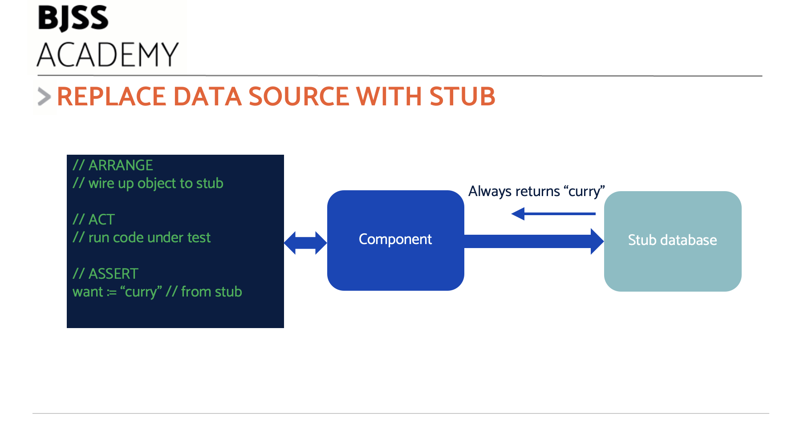

# Working with Test Doubles

Using Dependency Inversion allows us to _replace_ the real dependencies with _fake_ dependencies for testing.


This makes no difference to our code, nor our test.

When we execute our application logic, we are only concerned with _that piece_ of logic does. We write code that will take data and transform it, or make decisions and act on them. This logic is independent of any source of data or target for actions.

That's the secret of _Test Doubles_.

## What are Test Doubles?

The name _Test Double_ comes from the world of movies.

When an actor is required to perform stunt work, usually a _stunt double_ is substituted for the real actor. They look similar. The specialist stunt performer can safely act out the hazardous action in the scene. The real actor will be unharmed - and most likely will not have the required skills to perform the stunt.

In software, a Test Double is a dummy component that simulates the real component for testing.

## Advantages and uses of Test Doubles

Test doubles have several advantages, when used to replace difficult dependencies:

- Tests are Fast. No waiting around for connections, networks and more
- Tests are Isolated. We don't track long-term state in our doubles. Compare that to a 'development test database'
- Tests are Repeatable. We fully control the doubles from inside our test, guaranteeing repeatable action
- We can simulate hard-to-obtain events. Examples: network failure, corrupt data, power failure
- We avoid adding test data into production systems during testing
- We avoid using third-party systems, possibly incurring costs

## Kinds of Test Doubles

There are several kinds of test double that we can use. Each one has a different purpose.

The two most useful are known as the _stub_ and the _mock_.

### Stubs - Testing sources

_Stubs supply pre-canned data_

A stub object simulates a source of something. The stub object exactly conforms to the programming interface of some 'difficult dependency' and simulates it for the test. A stub database, for example, simulates the data we can fetch from a real database.

By using Dependency Inversion (as per the previous chapter), then we are free to swap the real object with the stub for use within our code. The tests wire up the stub. Production code wires up the real object.

The major advantage here is that our production code under test works the same way for both cases. There is no conditional behaviour inside it. No "if test mode is active" type stuff. Once the test passes against the stub, it will pass against the real object.

#### Pre-canned data pins down assertions

A stub always returns well-known, pre-canned data.



The advantage is that our test can rely on this data. It is guaranteed to always be the same.

Because the input to our code is always the same, we can determine the expected outcome.

This allows us to write the Assert section of our test with confidence.

[This playground](https://goplay.tools/snippet/7ljrYRCZ5EW) shows an example of a stub in use. In this code, the stubbed-out data is a favourite food of "curry". This allows us to write the assertion.

### Example: Stubbing the System Clock

A good example of stubbing involves time-sensitive actions.

In the production code below, we want a function that will return AM or PM depending on the time of day. This will be hard to test if the function uses the actual; system time. To fix that, we use Dependency Inversion, and create an abstraction of reading the time:

```golang
type Clock interface {
	Now() time.Time
}
```

We can write a function which depends on this abstraction instead of the system time directly:

```golang
func amOrPm(clock Clock) string {
	timeNow := clock.Now()

	if timeNow.Hour() < 12 {
		return "AM"
	}

	return "PM"
}
```

The time is being taken from whatever object is being passed into the function as the `clock` parameter.

In the production code, this would be a SystemClock object, defined like this:

```golang
type SystemClock struct {
    // empty
}

func (s SystemClock) Now() time.Time {
    return time.Now()
}
```

For our tests, we want to replace the `SystemClock` with a `StubClock`:

```golang
// Stub clock - enables simulation of specific times
type StubClock struct {
	time time.Time
}

// Convenience Construction function
func NewStubClock(simulatedTime time.Time) StubClock {
	return StubClock{time: simulatedTime}
}

// Implements interface to return stubbed time setting
func (s StubClock) Now() time.Time {
	return s.time
}
```

We provide a convenience construction function. This allows our Arrange step to set up any simulated time it likes. The Act step will pass this stub clock in to our production code function.

Here is our first test:

```golang
func TestAMBeforeNoon(t *testing.T) {
	// Arrange
	stubClock := NewStubClock(time.Date(2024, 06, 10, 1, 00, 00, 0, time.UTC))

	// Act
	got := amOrPm(stubClock)

	// Assert
	want := "AM"
	if got != want {
		t.Errorf("got: %v, want: %v", got, want)
	}
}
```

This runs our function with a date of 10 June 2024 and a time of 1:00 AM. Given this time, we can expect the result to be "AM".

We can use a second test of the same format. We set the stubbed clocked time to be 1:00PM in the afternoon:

```golang
func TestPMAfterNoon(t *testing.T) {
	// Arrange
	stubClock := NewStubClock(time.Date(2024, 06, 10, 13, 00, 00, 0, time.UTC))

	// Act
	got := amOrPm(stubClock)

	// Assert
	want := "PM"
	if got != want {
		t.Errorf("got: %v, want: %v", got, want)
	}
}
```

Stubs enable us to simulate difficult-to-trigger conditions. The occurrence of a specific time is a good example of that.

You can run this code in [this playground](https://goplay.tools/snippet/LBV0cz0d4Ne)

### Mocks - Testing sinks

_Mocks record interactions_

Stubs pretend to be a _source_ of something. They are good at simulating an _input_ to a process.

But how do we simulate an _output_ device?

Examples of output devices include:

- Payment Processor that accepts credit card payments
- Email sending service that emails customers
- User interface output
- Controlled hardware - perhaps actuators in a robot

Whereas a stub provides input to a process, what we need here is some way of capturing the output from a process. Was the payment provider called with the correct details? Was the robot arm commanded to move six degrees left?

To capture interactions and commands, we use a _Mock_ object.


### Example: Mocking a payment service

## Other kinds of doubles

Other kinds of test double exist

- **Fake** is an advanced stub that simulates behaviour of the real component. An example would be an in-memory database that stores data and executes queries properly against that data.
- **Spy** wraps a real component and can record interactions/modify data

Fakes can be useful. Beware that once they get complex, the Fake needs developing with TDD _itself_ to guarantee its simulated behaviours match those intended.

## Caveats with test doubles

There are some gotchas to watch out for when using test doubles

### Be careful of mocking what you do not own

Beware of creating a detailed test double of any external service.

Suppose we write a test double of a payment service. We test our logic, and it works fine with our double. Our double is accurate, and the code works in production once we swap from the test double to the real service.

Then the service changes its API. But we don't find out.

Our code will continue to pass its tests against the existing mock. But it will _fail_ when we use it with the new version of the real service.

To avoid this, either:

- Don't mock what you don't own
- Use [contract testing](https://martinfowler.com/bliki/ContractTest.html) to check the fidelity of the real service

### Do not test the double!

Be certain to test the logic that operates on the test double, and _not_ the test double itself!

## Next: TDD and agility

[How TDD assists true agility >>](/chapter10/chapter10.md)
