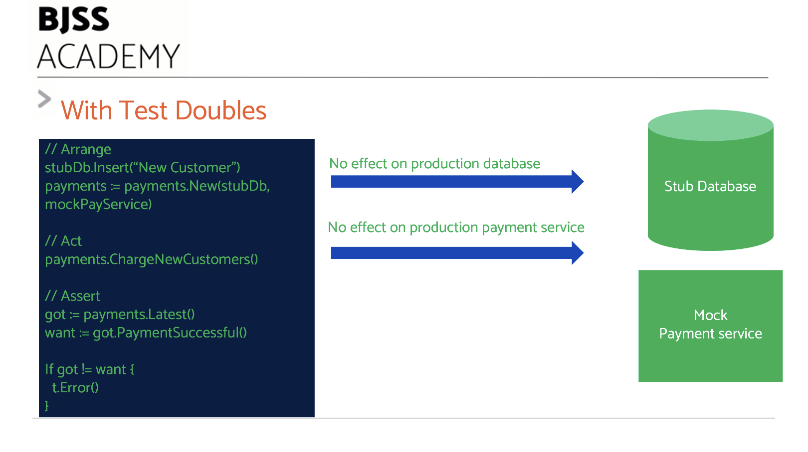

# Working with Test Doubles

Using Dependency Inversion allows us to _replace_ the real dependencies with _fake_ dependencies for testing.

This makes no difference to our code, nor our test.

When we execute our application logic, we are only concerned with _that piece_ of logic does. We write code that will take data and transform it, or make decisions and act on them. This logic is independent of any source of data or target for actions.

That's the secret of _Test Doubles_.

## What are Test Doubles?

The name _Test Double_ comes from the world of movies.

When an actor is required to perform stunt work, usually a _stunt double_ is substituted for the real actor. They look similar. The specialist stunt performer can safely act out the hazardous action in the scene. The real actor will be unharmed - and most likely will not have the required skills to perform the stunt.

In software, a Test Double is a dummy component that simulates the real component for testing.

## Kinds of Test Doubles

There are several kinds of test double that we can use. Each one has a different purpose.

the two most useful are known as the _stub_ and the _mock_.

### Stubs - Testing sources

A stub object simulates a source of something. A stub database simulates the data we can fetch from a real database.

A stub always returns well-known, pre-canned data.

The advantage is that our test can rely on this data. It is guaranteed to always be the same.

### Mocks - Testing sinks

### Other kinds of doubles

Other kinds of test double exist

- **Fake** is an advanced stub that simulates behaviour of the real component. An example would be an in-memory database that stores data and executes queries properly against that data.
- **Spy** wraps a real component and can record interactions/modify data

Fakes can be useful. Beware that once they get complex, the Fake needs developing with TDD _itself_ to guarantee its simulated behaviours match those intended.

## Example: Stubbing the System Clock

## Example: Mocking a payment service

## Caveats with test doubles

There are some gotchas to watch out for when using test doubles

### Be careful of mocking what you do not own

Beware of creating a detailed test double of any external service.

Suppose we write a test double of a payment service. We test our logic, and it works fine with our double. Our double is accurate, and the code works in production once we swap from the test double to the real service.

Then the service changes its API. But we don't find out.

Our code will continue to pass its tests against the existing mock. But it will _fail_ when we use it with the new version of the real service.

To avoid this, either:

- Don't mock what you don't own
- Use [contract testing](https://martinfowler.com/bliki/ContractTest.html) to check the fidelity of the real service

### Do not test the double!

Be certain to test the logic that operates on the test double, and _not_ the test double itself!

## Next: TDD and agility

[How TDD assists true agility >>](/chapter10/chapter10.md)
