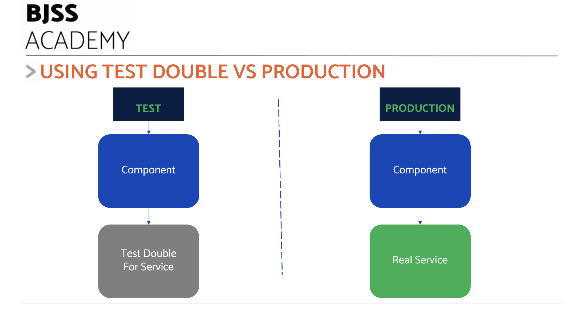
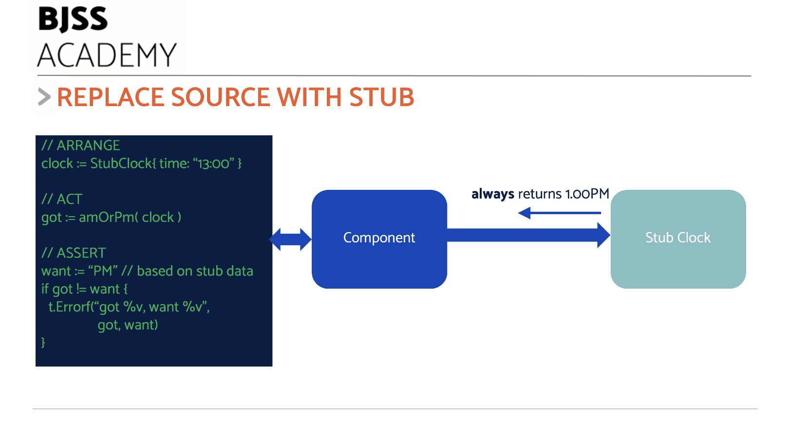
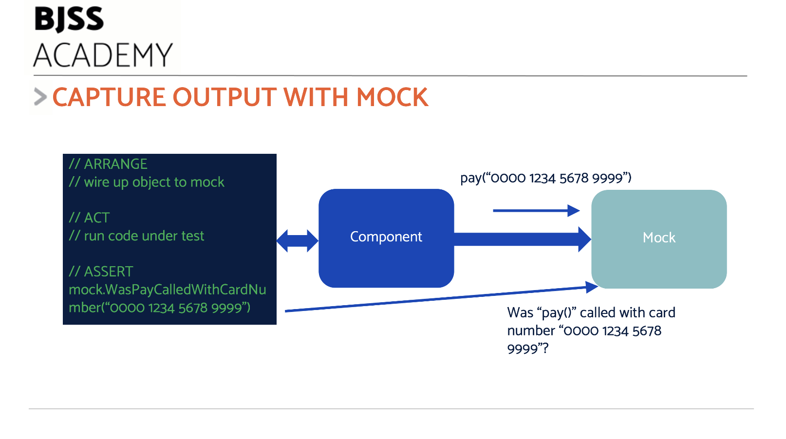

# Working with Test Doubles

Using Dependency Inversion allows us to _replace_ the real dependencies with _fake_ dependencies for testing. These fakes are called _Test Doubles_.



When we execute our application logic, we are only concerned with what _that piece_ of logic does. It will contain some process that acts on inputs, and produces observable outputs. This logic is independent of the sources of input, or the targets for output.

A process to produce a report on some user information works the same way no matter where the user data comes from. Perahps from a database, or a file. Maybe it was manually typed in. It doesn't matter. The report generation logic does its thing and produces an output.

Our tests can take advantage of this design-level thinking.

## What are Test Doubles?

The name _Test Double_ comes from the world of movies.

When an actor is required to perform stunt work, usually a _stunt double_ is substituted for the real actor. They look similar. The specialist stunt performer can safely act out the hazardous action in the scene. The real actor will be unharmed. Most likely, they will not have the required skills to perform the stunt. The double does have the necessary skills.

In software, a Test Double is a dummy component that simulates some real component dependency. We sap in the double to assist testing code which uses this dependency.

## Advantages of Test Doubles

Test doubles have several advantages, when used to replace difficult dependencies:

- Tests are Fast. No waiting around for connections, networks and more
- Tests are Isolated. We don't track long-term state in our doubles. Compare that to a 'development test database'
- Tests are Repeatable. We fully control the doubles from inside our test, guaranteeing repeatable action
- We can simulate hard-to-obtain events. Examples: network failure, corrupt data, power failure
- We avoid adding test data into production systems during testing
- We avoid using third-party systems, possibly incurring costs

## Kinds of Test Doubles

There are several kinds of test double that we can use. Each one has a different purpose.

The two most useful are known as the _stub_ and the _mock_.

## Stubs - Testing sources of data and events

_Stubs simulate an input source of data or events_



We can think of our code under test as a process with inputs and outputs. These can be data that enters or leaves the process. Data can be an input to the process, such as user information pulled from a database. Or the input can be an event, such as be an HTTP POST request, with a payload of data.

Our component under test essentially runs some process to act on this input. It is that action that we wish to test.

### Using Dependency Inversion to enable Stub usage

Using [Dependency Inversion/Injection](https://github.com/bjssacademy/advanced-tdd/blob/main/chapter09/chapter09.md#dependency-inversion---decoupling-dependencies), we can design our component to be independent of the exact source of the input. This allows us to configure the component to use either the real source - say a database - or some other source specifically for testing.

A **stub** simulates an input source. It conforms to the programming interface of the input source, and simulates it for the test. A stub database, for example, can simulate what a database would do if queried for some user information.

Our test code will create a stub and inject the stub in to the component under test. The Arrange section can configure the stub, if need be. The Assert section can be written in the light of knowing what the stub will return.

Our production code uses the same component code unchaged. But we inject a real version of the dependency we stubbed out.

This gives us a major advantage: the code we tested _does not change_ when we use it in production. The tests remain valid. Only the input source is changed - and we test that code separately.

### Pre-canned data pins down assertions

Stubs always return the same data values, or trigger the same events, every time they are called. Known as _pre-canned_ data, this helps us figure out what result to expect from our process under test.

This feature of stubs allows us to work out the expected results in our Assert step. Significantly, it makes that test repeatable. The stub will always do the same thing on every test run, in every environment.

### Useful kinds of stubs

Anything providing an input or a trigger to a process is a candidate for stubbing in tests.

Examples include:

- **Databases**: Return stub data for queries ([example](https://goplay.tools/snippet/7ljrYRCZ5EW))
- **Keyboard input**: Text from a keyboard or GUI can be stubbed
- **Web Requests**: A request from a browser can be stubbed locally, avoiding HTTP calls
- **Reference Data**: Data like tax tables can be stubbed, with values to explore our logic
- **Events**: Events like a setTimeout() callback or onClick() can be stubbed. Call the event handler directly with stub data

## Example: Stubbing the System Clock

Run this code [here](https://goplay.tools/snippet/ehNnrYO99p1)

A good example of stubbing involves time-sensitive actions.

In the production code below, we want a function that will return AM or PM depending on the time of day. This will be hard to test if the function uses the actual system time. To fix that, we use Dependency Inversion, and create an abstraction of reading the time.

Let's start by writing the first part of our test, starting with the assert:

```golang
func TestAMBeforeNoon(t *testing.T) {
	// Assert
	want := "AM"
	if got != want {
		t.Errorf("got: %v, want: %v", got, want)
	}
}
```

What is variable `got`? Our first design choice is to have a function called `amOrPm()` that returns the string "AM" or "PM".

To get moving, that's all it will do right now:

```golang
func TestAMBeforeNoon(t *testing.T) {
	got := amOrPm()

    // Assert
	want := "AM"
	if got != want {
		t.Errorf("got: %v, want: %v", got, want)
	}
}
```

Add the function definition itself:

```golang
func amOrPm() string {
    return ""
}
```

Run the test and watch it fail. Add basic code to make the test pass:

```golang
func amOrPm() string {
    return "AM"
}
```

Run the test and it passes. Happy days.

The next test will drive out some more design decisions. The function needs to be able to return "PM" when the time is after 12 noon. Let's try a test for that:

```golang
func TestPMAfterNoon(t *testing.T) {
	got := amOrPm()

    // Assert
	want := "PM"
	if got != want {
		t.Errorf("got: %v, want: %v", got, want)
	}
}
```

Now, depending on when you run the tests, one of them is going to fail! This is, of course, useless.

We've fallen for the _difficult dependency_ trap. We coupled directly to the system clock.

D'Oh!

We need to decouple that and introduce an abstraction for the clock.

I'm choosing to bite the bullet, and pass in an interface into the `amOrPm()` function as a parameter. This will be the abstraction for our source of system time.

As this changes the programming interface, we'll need to update the tests. I prefer to comment out one of the two tests and work on one test first:

```golang
func TestAMBeforeNoon(t *testing.T) {
	got := amOrPm(clock)

    // Assert
	want := "AM"
	if got != want {
		t.Errorf("got: %v, want: %v", got, want)
	}
}
```

and this will need an interface adding:

```golang
type Clock interface {
    Now() time.Time
}
```

which allows us to change the function signature:

```golang
func amOrPm(clock Clock) string {
    return "AM"
}
```

and update our test to include a stub clock to pass in:

```golang
func TestAMBeforeNoon(t *testing.T) {
    // Arrange
    clock := StubClock{}

    // Act
    got := amOrPm(clock)

    // Assert
	want := "AM"
	if got != want {
		t.Errorf("got: %v, want: %v", got, want)
	}
}
```

We then need to define a `StubClock`:

```golang
type StubClock struct {
    // empty
}
```

And make the stub clock conform to the `Clock` interface:

```golang
func (s StubClock) Now() time.Time {
    return time.Date(2024, 06, 10, 1, 00, 00, 0, time.UTC)
}
```

This stub returns the pre-canned date/time of 10 June 2024 at 1:00 AM in the morning, UTC.

We can run our test again, and it will pass.

This single test is not enough to triangulate the implementation of `amOrPm()`.

Let's reintroduce the PM test.

We update it to use the new stub:

```golang
func TestPMBeforeNoon(t *testing.T) {
    // Arrange
    clock := StubClock{}

    // Act
    got := amOrPm(clock)

    // Assert
	want := "PM"
	if got != want {
		t.Errorf("got: %v, want: %v", got, want)
	}
}
```

We run the test and it fails. We have two issues to resolve:

- The Stub only ever returns a time that is in the morning. It cannot be used as-is to test PM behaviour
- `amOrPm()` has no logic to return "PM" yet

Let's make the stub more capable:

```golang
type StubClock struct {
    hourOfDay int
}

func (s StubClock) Now() time.Time {
    return time.Date(2024, 06, 10, s.hourOfDay, 00, 00, 0, time.UTC)
}
```

This improved stub can be configured by the test Arrange step to return a specific hour of the day.

By default, the stub will return Midnight - enough to make our "AM" test pass. But the PM test fails.

We need to change the Arrange step of the PM test to include a suitable hour of the day:

```golang
func TestPMBeforeNoon(t *testing.T) {
    // Arrange
    clock := StubClock{hourOfDay: 13}

    // Act
    got := amOrPm(clock)

    // Assert
	want := "PM"
	if got != want {
		t.Errorf("got: %v, want: %v", got, want)
	}
}
```

The test fails, as we still have no logic in `amOrPm()`. Add that:

```golang
func amOrPm(clock Clock) string {
   if clock.Now().Hour() < 12 {
        return "AM"
   }

   return "PM"
}
```

Both tests now pass:

```console
=== RUN   TestAMBeforeNoon
--- PASS: TestAMBeforeNoon (0.00s)
=== RUN   TestPMAfterNoon
--- PASS: TestPMAfterNoon (0.00s)
PASS
```

## Mocks - Testing sinks

_Mocks record output interactions with other components_



Stubs simulate inputs to our process. A Mock simulates an output target of our process.

Our component under test will create some observable outcome. If it is a pure function, then the output will be some piece of returned data. Perhaps a created object. We can assert against those easily.

A more challenging case is where our component has a _behaviour_ as its output.

Perhaps it calls a method on another object. Maybe it calls a function that was passed-in. Maybe it places an event on an event bus.

In each case, we cannot simply assert against an output data valuse, as the code simply does not work like that.

We must _capture_ the behaviour.

Mocks capture interactions by recording them. A mock for a payment service will record the different calls made to that service, and what the parameters to those calls were. A mock for an event bus will record which events were sent to it.

Our test can wire up the mock object to the component we are testing in the arrange step.

The act step causes our component to run, as normal.

The assert step is a little different; it queries the mock object to find out if any interaction happened. If so, what exactly happened?

### Useful kinds of mocks

Anything which is acted upon by our component is a candidate for a mock during testing:

- Payment Processor that accepts credit card payments
- Email sending service that emails customers
- User interface output
- Controlled hardware - perhaps actuators in a robot

## Example: Mocking a payment service

Run this code [here](https://goplay.tools/snippet/DjxeQXIHeVQ)

In this example, we are test-driving a simple function `MakePayment`. This function will make a single payment to an external payment service. We want to test that it makes the right call.

We can start by writing the Act step of the test and making our first design decision:

```golang
func TestPaymentMade(t *testing.T) {
	// ACT - call our function, pass it an implementation of the payment service
	MakePayment(payments)
}
```

We've gone for a simple function `MakePayment()` which will make a single payment to a third-party service. By design, we will pass in some object representing that payment service, as the first and only parameter. This is a use of Dependency Injection.

We don't have a `payments` object just yet. We need to create one.

The first step is to define an abstraction of the payments service that's good enough for our application:

```golang
type Payments interface {
	Pay(accountId string, amount string)
}
```

Our production code would write an implementation of the `Pay()` method. It would talk to a real bank, or real payment service like Stripe. We're not going to write that now. We only want to TDD the `MakePayment()` logic at this stage.

For our test, we want to avoid calls to the real service. We instead want to capture the fact that a call happened.

We can create a Mock payments service to do this. Starting with the test Arrange step:

```golang
func TestPaymentMade(t *testing.T) {
	// ARRANGE - create mock
	mockPay := &MockPayments{}

	// ACT - call our function, pass it the mock
	MakePayment(mockPay)
}
```

That's enough to code up the `MakePayment()`` with a do-nothing implementation:

```golang
func MakePayment(payments Payments) {
    // Not implemented
}
```

We can then add details of a Mock payments service:

```golang
type MockPayments struct {
	wasCalled bool
	accountId string
	amount    string
}

func (m *MockPayments) Pay(accountId string, amount string) {
	m.wasCalled = true
	m.accountId = accountId
	m.amount = amount
}
```

This mock conforms to our `Payments` interface and can be substituted for it. It records if the `Pay()` method was ever called. If it was, it records the values of the parameters it was called with.

We need to specify what we want the observable behaviour of `MakePayment()` to be. We do this by writing the assert step:

```golang
func TestPaymentMade(t *testing.T) {
	// ARRANGE - create stub
	mockPay := &MockPayments{}

	// ACT - call our function, pass it the stub
	MakePayment(mockPay)

	// ASSERT - Did we ever call the service? What parameters were used in the call?
	payCalled := mockPay.wasPayCalledWith("Alan", "24.95 GBP")

	if !payCalled {
		t.Errorf("expected Pay to be called correctly: got %v", mockPay)
	}
}
```

We've added a new method on the mock `wasPayCalledWith`:

```golang
// Helper method for asserting Pay() was called with the correct parameter values
func (m MockPayments) wasPayCalledWith(expectedAccountId string, expectedAmount string) bool {
	return m.wasCalled && m.accountId == expectedAccountId && m.amount == expectedAmount
}
```

This method allows us to review the interaction recorded by the mock.

> **Note**: This method is for test-only. It _should not appear_ in the `Payments` interface

If we run the test - with an empty implementation of `MakePayment()`, it fails:

```console
=== RUN   TestPaymentMade
    prog_test.go:47: expected Pay to be called correctly: got &{false  }
--- FAIL: TestPaymentMade (0.00s)
FAIL
```

This allows us to add the production code to make the test pass:

```golang
func MakePayment(payments Payments) {
	// In reality, there would be more complex code, of course
	payments.Pay("Alan", "24.95 GBP")
}
```

The test passes. Our code did call the `Pay()` method and sent the right parameters.

The test will also pick up programming errors, such as sending the wrong values:

```console
=== RUN   TestPaymentMade
    prog_test.go:47: expected Pay to be called correctly: got &{true wrong-user 0.00 GBP}
--- FAIL: TestPaymentMade (0.00s)
FAIL
```

## Other kinds of Test Doubles

Other kinds of test double exist

- **Fake** is an advanced stub that simulates behaviour of the real component. An example would be an in-memory database that stores data and executes queries properly against that data.
- **Spy** wraps a real component and can record interactions/modify data

Fakes can be useful. Beware that once they get complex, the Fake needs developing with TDD _itself_ to guarantee its simulated behaviours match those intended.

Spies are basically Mocks, but with a pass-through to the target service. As a result, I find them less useful. They seem to me to paper over a failure in abstraction. But if you find yourself in that position with a deadline, it's nice to know they are there.

## Caveats with test doubles

There are some gotchas to watch out for when using test doubles

### Be careful of mocking what you do not own

Beware of creating a detailed test double of any external service.

Suppose we write a test double of a payment service. We test our logic, and it works fine with our double. Our double is accurate, and the code works in production once we swap from the test double to the real service.

Then the service changes its API. But we don't find out.

Our code will continue to pass its tests against the existing mock. But it will _fail_ when we use it with the new version of the real service.

To avoid this, either:

- Don't mock what you don't own
- Use [contract testing](https://martinfowler.com/bliki/ContractTest.html) to check the fidelity of the real service

### Do not test the double!

Be certain to test the logic that operates on the test double, and _not_ the test double itself!

## Next: TDD and agility

[How TDD assists true agility >>](/chapter10/chapter10.md)
