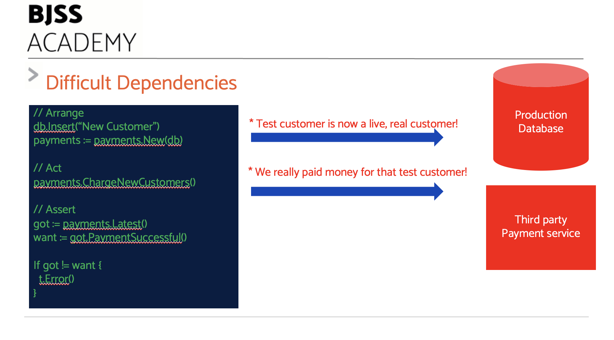
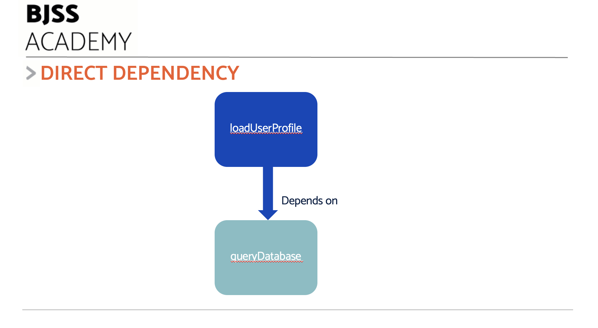
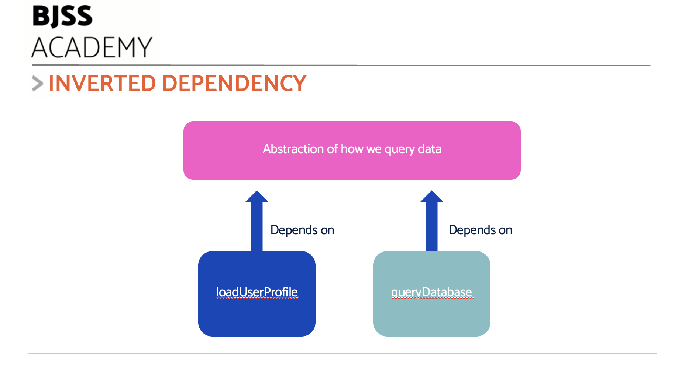
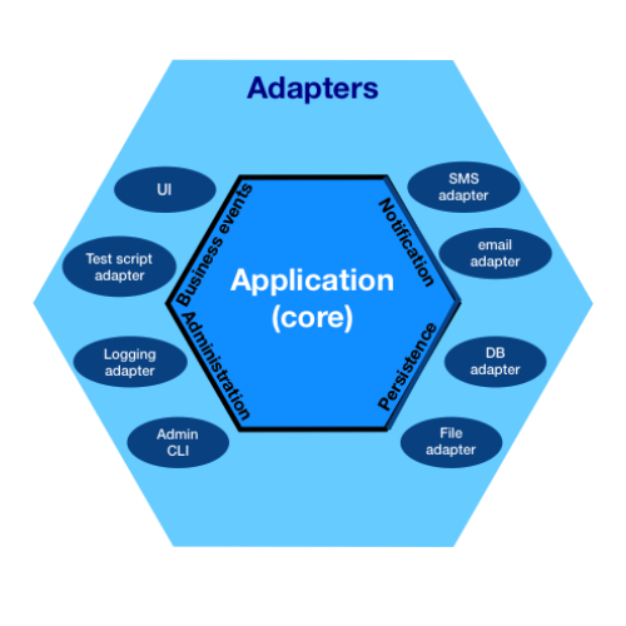

# Difficult Dependencies and Dependency Inversion

As we grow our system using TDD, we will run into a major problem.

How do we test the code that interacts with external systems?

External systems like payment processors form difficult dependencies to test. How would we test code that sends a pyment of ten pounds to a payment processor, without actually sending ten pounds every time we run the test?

## What are difficult dependencies?

Here's a common testing nightmare: code that talks to the production database and a third-party payment service:



The code we want to test directly accesses the live customer database and the third-party payment service. Anything our test does will affect both of those! It's only a test - we don;t want to add a test customer into live. We _really_ don't want to pay on each test run!

### It's a problem of control

Technically, a 'difficult dependency' is a connection to a system that we don't have full control over.

Our code depends on this system to do its work. Our test will have to setup this dependency and quite likely assert against some observable change in its behaviour.

Both the setup, done in the arrange step, and the verification in the assert step can be problematic.

Let's look at some common cases to see why.

### Databases

The most common problem is testing code that accesses a database.

Here's a function that will read a database table called `Profiles` and return a struct of user profile data:

```golang
func loadUserProfile(id int) UserProfile {
    query := "SELECT name, favouriteFood FROM Profiles WHERE id = ?"

    results := queryDatabase(query, id)

    return UserProfile{
        id: id,
        name: results[0],
        favouriteFood: results[1]
        }
}
```

With a bit of artistic licence assuming the function `queryDatabase` exists and returns a slice of column values. You can see how that gets mapped into a struct.

This is hard to test. But why?

- We need a database server running
- It must have a valid connection
- The network must work
- We must have a database user account and password
- The database must have a table called Profiles
- The table must have the correct columns
- We must either have some test data in that table, or be able to add it

All this causes several difficulties:

- The test will be very slow to run
- A test fail might be because the database is down, and not because our code failed the test
- What if we add data to the production database during the test?
- If we have pre-set data in a test database, the test is hard to read: why are we looking for a user called "Daffy Duck"?

This is how we get slow and flaky tests. This is a violation of FIRST test principles.

### User interfaces

Testing through user interfaces can be slow. We need to simulate key presses, clicks and navigation. We need to scrape screen content to check the results.

### System time

Any code that directly access the system clock to perform time-sensitive actions is hard to test. We would have to change the system time in the test.
This is often impractical. It may cause other running applications to fail, or data to be stored incorrectly.

### Random number generators

Simulations, games and statistical applications often use sources of random numbers. Code that relies on these sources is difficult to test. Given a random input, we can't predict the output. That means we can't write the assert section of our test. Oh dear.

## Managing dependencies by design

The problem here is direct coupling to a system we cannot easily control or inspect.

A key insight is that _we do not even care_ about that system. We are not testing that system. We only want to test drive code that _works with the results_ of that system. We're not bothered about reading data from a database. We are bothered about the logic our code does to that data. We're not bothered about reading the system time. We are bothered about what our code does in response to a specific time.

This insight hints at a solution:

- Test only the logic of our code
- Use a less-difficult dependency to replace our difficult one

What if we swapped our database with something under our full control? Something that _pretended_ to be a database, but had none of the issues of the real thing?

We can imagine replacing the database with something that always returned some pre-canned data for our User Profile code. Or a replacement fake random number generator, that always returned the number 4.

By doing this, our tests are simple. We avoid dealing with all the difficulties of our original dependency. No connections. No logins. No randomness. We can easily write a FIRST test. We can easily write an assert, now we can be certain of how our new dependency behaves.

It leaves only one question.

_How can we design our code to swap out a difficult dependency?_

### Dependency Inversion - Decoupling Dependencies

Fortunately for us, the answer comes from standard software design: **Dependency Inversion**.

The reason our `loadUserProfile` function was hard to test is because of the line

```golang
result := queryDatabase(id)
```

This line causes a direct coupling to the query database function. Assume here that inside this function, we connect to a real SQL database and query it.



_We need to break this direct connection._

Instead of directly calling `queryDatabase()`, we need that code to indirectly call it. It needs to call _something else_ that will allow us to swap out the actual call made.



We can do this in one of two ways, either using Object Oriented techniques or Functional Programming techniques.

In both cases we use two techniques:

- Dependency Inversion
- Dependency Injection

These are two sides of the same coin. Let's describe them briefly.

#### Dependency Inversion Pricniple (DIP)

In our example, `loadUserProfile` directly depends on a function `queryDatabase` to do its job.

> Generally, a component A depends on B if A has any knowledge of the specifics of B.

Dependency Inversion means we break that.

We introduce an indirection of some kind - an interface, or an agreement. Let's call this C.

If we make A refer to C instead of B, we have broken the cycle. We make C something like an interface, or a passed-in function. That way, we can wire-up the code so that anything that conforms to C can be used. We arrange for B to conform to C, so we can swap that in for the real code. But we can also swap in anything else that conforms to C.

An example in Go is the [`Reader`](https://go.dev/tour/methods/21) interface. Our code (component A) can call the `Read` method on this interface (C above). We say our code _depends on_ the Reader interface (or A depends on C in our generalised world).

Anything can be used that implements the `Read` method. We simply wire-up whatever implementation of the `Reader` interface we want.

#### Dependency injection (DI)

This idea of wiring up the correct dependency is called, predictably enough, Dependency Injection. We _inject_ a dependency.

We can do this in either an Object Oriented way (using interfaces), or a Functional way (using passed-in functions).

In either case, we have a piece of logic `fetchUserProfile` which will use Dependency Inversion to access data.

#### Object Oriented Dependency Inversion

In this OO version, our component is an object `UserProfiles`. Method `fetchUserProfile(id)` will call out to our chosed data source to get facts about a user. It will use those to create a `UserProfile` struct.

We apply Dependency Inversion by introducing the interface `DatabaseQuery`. Our `UserProfiles` object will keep a reference to some implementation of this interface. Our logic will call that, instead of directly calling the real database.

In the code below, we provide a _stub_ (ie pretend) database object and use that. Stubs are explained in detail later.

We Use Dependency Injection () to inject our stub into the `UserProfiles` object.

```golang
package main

import (
	"fmt"
)

type UserProfile struct {
	id            int
	name          string
	favouriteFood string
}

// Low level interface that represents database access
// This is a very thin abstraction. An improvement is to use the Repository Pattern
type DatabaseQuery interface {
	queryDatabase(query string, id int) []string
}

// Our logic code is now an object with the method fetchUserProfile
// It depends on the DatabaseQuery abstraction
type UserProfiles struct {
	db DatabaseQuery
}

// The logic that processes results from whichever database implementation we choose
func (u UserProfiles) fetchUserProfile(id int) UserProfile {
	query := "SELECT name, favouriteFood FROM Profiles WHERE id = ?"

	results := u.db.queryDatabase(query, id)

	return UserProfile{
		id:            id,
		name:          results[0],
		favouriteFood: results[1],
	}
}

// Stub object - pretends to be a database
type FakeDatabase struct {
}

// Stub database must implement the queryDatabase method defined in
// the DatabaseQuery interface
func (f FakeDatabase) queryDatabase(query string, param int) []string {
	return []string{"Alan", "curry"}
}

func main() {
	// Create stub database object
	fakeDatabase := FakeDatabase{}

	// Dependency Inject the stub into UserProfiles consumer code
	profiles := UserProfiles{db: fakeDatabase}

	// Use the UserProfiles object to fetch a profile
	profile := profiles.fetchUserProfile(3)
	fmt.Println(profile)
}
```

See this version of code run in [this playground](https://goplay.tools/snippet/FU3_VrYxFhn)

#### Functional Dependency Inversion

This approach uses function currying and closures.

- function `fetchUserProfile(id) will close over a supplied refernce to a `queryDatabase` function
- Our code calls the supplied function reference to get data
- Our logic uses this returned data, unaware of exactly where it came from
- At run time, we create this closure with the dependency we want to use

We still use Dependency Inversion and Dependency Injection. They just use different technqiues at the syntax level.

```golang
package main

import (
	"fmt"
)

type UserProfile struct {
	id            int
	name          string
	favouriteFood string
}

func createFetchProfileFunction(queryDatabase func(string, int) []string) func(int) UserProfile {
	return func(id int) UserProfile {
		query := "SELECT name, favouriteFood FROM Profiles WHERE id = ?"

        // calls whatever function we passed in ... we don;t know, here, what exactly gets called
		// This is the Dependency Inversion at work
		// This code does not depend on the details of which exact function is called
		// It depends on the abstraction - the fact that some function will get called
		// with the parameters listed, and it will return a slice of results
		results := queryDatabase(query, id)

		return UserProfile{
			id:            id,
			name:          results[0],
			favouriteFood: results[1],
		}
	}
}

// An example of a 'stub' - a dummy version of our database (see later)
func fakeQueryDatabase(query string, param int) []string {
	return []string{"Alan", "curry"}
}

func main() {
	// Dependency Injection: We inject our concrete dependency here
	// We pass in the stub function in this code
	// For production code, we would pass in a function that accessed the database for real
	fetchUserProfile := createFetchProfileFunction(fakeQueryDatabase)

	profile := fetchUserProfile(3)
	fmt.Println(profile)
}
```

We first call `createFetchProfileFunction` to create our fetchUserProfile function. We have passed in our `fakeQueryDatabase` function in this case. That gets bound to the `queryDatabase` parameter. We return a function from this function - basic function currying. The returned function _closes over_ the queryDatabase parameter. Whenever we call this newly minted returned function, it will use whatever value was closed over in queryDatabase.

We can change which actual function gets called by the line reading `results := queryDatabase(query, id)`.

In the test example above, this means we will call the `fakeQueryDatabase` function. This isn't a database, of course. It returns pre-canned data.

You can see this code run on [this playground](https://goplay.tools/snippet/OzAa74pfI67)

## Hexagonal architecture

If we invert the dependencies on _every_ external system, we end up with an architectural pattern known as _Hexagonal Architecture_



Hexgonal Architecture features two distinct layers:

- **Domain** Our model of the problem our application solves
- **Adapters** Connect our domain model components to the outside world

### Domain Layer

The domain layer is where we model the problem that our application solves. It's the part where all the logic goes.

You'll notice some 'obvious' things missing from a domain layer. If we are using a SQL database to store User Profiles, you'll see a representation of a User Profile. But you _won't_ see any SQL statements, or database connection strings.

These details of how we connect to the wider system are hidden behind abstractions. These abstractions are called _ports_ in Hexagonal terminology.

A port for our user profile access might look like this:

```golang
type UserProfileRepository interface {
	FindById(userId int)(UserProfile, error)

	Save(profile UserProfile) error

	Delete(userId int)
}
```

This is an abstraction of the CRUD operations that our application needs. They are expressed in purely _domain terms_.

There is nothing here that suggests how this repository will be implemented.

This is a classic use of Dependency Inversion. The domain model remains unaware of any details of the repository.

So ... where does all that detail go?

### Adapter Layer

Glad you asked. The details of how we connect to the outside world live in the Adapter layer.

The code blocks used to implement connections are called _adapters_. They are based on the [Adapter](https://refactoring.guru/design-patterns/adapter) design pattern. They adapt from the abstract workld of the domain into the grimy real world.

Our `UserProfileRepository` might be implemented with a postgres database, for example:

```golang
type UserProfileRepositoryPostgres struct {
	conn DatabaseConnection
}

func (r UserProfileRepositoryPostgres) FindById( userId int)(UserProfile, error) {
	query := "SELECT * FROM Profiles WHERE id = ? LIMIT 1"
	stmt := r.conn.CreatePreparedStatement(query)
	stmt.Bind(1, userId)
	columns[] := stmt.executeQuery()

	profile := UserProfile {
		id: userId
		name: columns["name"]
		description: columns["description"]
		imageUrl: columns["imageUrl"]
	}

	return profile
}
```

You can see here that the adapter contains details of SQL, the database library, the schema we have designed for storing profiles and so on.

It adapts in two ways:

- Adapts the abstract method "find me a profile, given this userId" into database specifics
- Adapts the returned SQL columns into a domain layer pure structure `UserProfile`

We could equally have an in-memory version of the `UserProfilesRepository` that has nothing at all to do with database details. It would continue to return the domain layer object `UserProfile`.

### Hexagonal Golden Rule

> _Domain objects must not depend on adapters_.

The power of this approach is that the domain model has no ties to specific technologies. That's the adapter layer job, to hide all that.

The domain model can then be FIRST unit tested at will. We can test small pieces of domain - a function, a method. And we can also teach larger units of the domain, such as a full user case.

This reduces the amount of integration testing needed. We still need some; testing the adapter layer components needs to get dirty with SQL and HTTP and whatever else is used. But we can make each adapter as _thin_ as possible. This drives application logic back into the domain where it belongs.

### Benefits

- Easy to TDD domain with FIRST tests
- Clean separation of incidental technologies like comms, data stores, HTTP
- Easy to apply Test Doubles (see later)
- Easy to replace a technology. For example sqp Postgres SQL database for Mongo NoSQL solution.
- Adapters have little logic, reducing testing

### Further reading on TDD and Hexagonal Architecture

Wikipedia has a good summary of [Hexagonal Architecture](<https://en.wikipedia.org/wiki/Hexagonal_architecture_(software)>)

The original inventor of Hexagonal Architecture has a 2024 book out about it, [here](https://www.amazon.co.uk/Hexagonal-Architecture-Explained-Alistair-Cockburn/dp/173751978X)

For more details about how TDD becomes more effective with hexagonal architecture, see [this book](https://www.oreilly.com/library/view/test-driven-development-with/9781803236230) by the author of the guide you are reading.

## Next: Test Doubles

Let's apply these designs to test dificult dependencies: [Test Doubles >>](/chapter09/chapter09-doubles.md)
