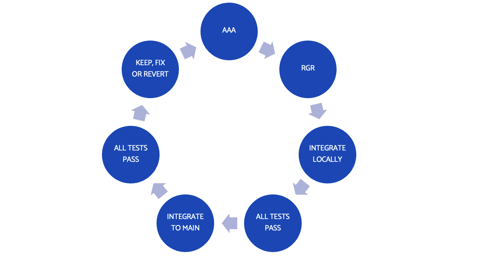

# 10: TDD, agility and Continuous Delivery

TDD is a key enabler of agility.

Being agile means having software that is:

- Always releasable to an end user, delivering value
- Always safe and straightforward to change

As we have seen, TDD helps us write code in small chunks, with the safety net of fast-runnning tests. This helps us deliver small chunks of value, that are known to work. The tests allow us to integrate work from different contributors, and have confidence that the whole system remains working.

Having automation of testing allows for Continuous Integration, keeping the whole team on the same page. Adding automation for deployment and infrastructure enables Continuous Delivery. This is the Gold Standard where we can ship code continuously, delivering value multiple times per day.

Compared to traditional workflows, this extra automation and confidence helps us cope with change.

## An agile TDD workflow

There is a natural rhythm to working this way. We work in micro-cycles, taking very small steps to add value:

- Use Arrange, Act, Assert to capture our specification as a test
- Work the Red, Green, Refactor cycle to create well-engineered code
- Run all tests locally to ensure this change has broken nothing
- Merge latest code from main into our code - this is the 'Continuous Integration' bit
- Run all tests again - make sure our code integrates smoothly with the main codebase. Ensure all tests pass
- Push this Continuous Integration merge to the main codebase

> Do not push on red!! Repeat! The main codebase should always be releasable

Using this workflow, we can add small increments of work and keep together as a team.

### Short running branches are essential

The key to Continuous Integration is to do what it says on the tin: Integrate code continuously.

The longer we work in our own little silo, the more we will diverge from decisions made in the rest of the time. This is dangerous and causes high waste.

We might spend three days coding on our laptop, only to find the key interfaces we programmed against were changed by Dave on Tuesday. Now our work goes in the bin and we start again.

### The true purpose of stand-ups

Standups often get hijacked by project managers to become status report sessions: "Ticket TCT 1372 in progress, TCT 1371 merged".

**This is useless to the development team**

Let's step back. The goal of our team is to deliver value rapidly and continuously to end users. A critical part is we deliver one single integrated codebase. That requires continuous integration. And that requires us communicating changes that might impact somebody else's technical decision making. Like changing an interface, or deleting a module.

Stand up is the forum to make the wider team aware of such changes, so that impacts can be managed. Maybe Dave can delay his refactoring until after your work is merged, and then you could pair up and refactor it all together.

But you can't decide that if you and Dave don't speak up.

Use standups to coordinate the team, not merely to update a progress chart.

## Danger, Will Robinson! What to do on broken build

So, we've finally earned our developer stripes and broken the build. Oh dear.

What should we do?

Given the importance of Continuous Integration in being agile, we need to get that build un-broken, pronto.

First, make sure people are aware that the build is NOT to be merged with right now. It is in an invalid state.

After that, we need to get busy fixing. It can be good to mob on this as a whole team, so bear that in mind.

There are two good options:

- Short time to forward fix: identufy the fault, fix it, integrate/test/push
- Revert the change. Get it out of the main codebase and back on to your machine for investigation

Both ways work. Remember the goal is to unblock the team quickly. The safe option is to revert the change. That unblocks the team quickly.

By working in micro-cycles, reverting code should be straightforward.

## When to integrate code?

One caveat about Continuous Integration is that the main codebase _always works_. The tests are all green. Every one of them. Always.

That implies only two times we can push our code:

- After we integrate locally, all tests green
- After we refactor, integrate locally, all tests green

We never push on red. We never push without integrating locally.

> We never break the build

Sometimes, we will break the build due to an oversight. Get the build back working quickly. We don't want to block the team from their integration work.

### Kent Beck's super-extreme idea

This is worth experimenting with: Test and commit or revert.

Have a look at the orignal article [Test & commit || Revert](https://medium.com/@kentbeck_7670/test-commit-revert-870bbd756864).

It seems impractical - maybe it is - but this will hone your skills in working in tiny batches of work, with little waste.

## Continuous Integration means many times per day

We need to work in a different way to do CI.

No more writing 1,000 lines of code in one session, without running it. No more giant functions. No more God Classes. No more hiding away for a month without talking to anybody.

Continuous Integration means organising our personal work increments so we can integrate several times a day. It means recognising that we are part of one team.

> CI is one technical way we can live the BJSS Value _We win and lose as a team_

If we are integrating once at the end of each sprint, we missed the CI memo. This is waterfall, pure and simple, with a separate Integration Phase at the end. Congratulations, the 1970s called and wanted you back.

Resist.

## Release strategies

Continuous Integration means having a single top copy of the codebase that is working and shared by the whole team at all times.

This code does not necessarily have to go live to users. It is better if it does, of course. A key tenet of agile is that the primary measure of progress is working software. Software that isn't in use isn't working.

There are a number of release strategies we can use.

The most powerful is called Continuous Delivery (CD), which means each change we check in gets delivered to end users. That requires an effective CI workflow, so you often see the term CI/CD.

But we can weaken this, if it suits needs:

- Staging: commit to blue/green awaiting live
- Progressive rollout: commit to small percentage of users live, then expand
- Quality Control Step: commit to a staging envirnoment, not live, for further testing
- Scheduled: deploy a release branch to live at slower intervals
  -- good for formal/regulated environments

In all cases, working so that we _could_ do Gold Standard CI/CD will allow us to easily do any of the other release strategies.

## Further Reading

Two excellent books cover these wider aspects of "how do we get stuff delivered to users":

- [Modern Software Engineering](https://learning.oreilly.com/library/view/-/9780137314942/), Dave Farley
- [Continuous Delivery](https://learning.oreilly.com/library/view/-/9780321670250/), Jez Humble and Dave farley

## Next

Some [final reflections >>](chapter11/chapter11.md)
